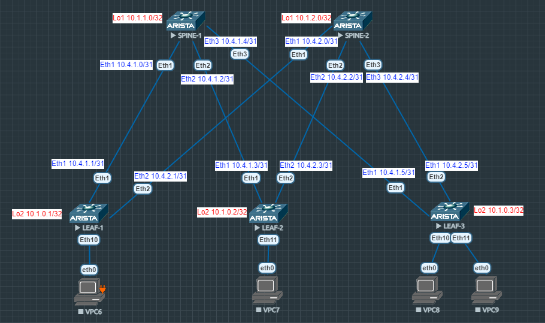

# Лабораторная работа №1
## Проектирование адресного пространства
### Цель:
- Собрать схему CLOS
- Распределить адресное пространство;
### Схема сети
## Выполнение:

### Таблица адресов

| hostname | interface |   IP/MASK   | Description |
| :------: | :-------: | :----------: | :---------: |
|  LEAF-1  | Loopback2 | 10.2.0.1 /32 |             |
|  LEAF-1  |  eth 1    | 10.4.1.1 /31 | SPINE-1     |
|  LEAF-1  |  eth 2    | 10.4.2.1 /31 | SPINE-2     |
|          |           |              |             |
|  LEAF-2  | Loopback2 | 10.2.0.2 /32 |             |
|  LEAF-2  |  eth 1    | 10.4.1.3 /31 | SPINE-1     |
|  LEAF-2  |  eth 2    | 10.4.2.3 /31 | SPINE-2     |
|          |           |              |             |
|  LEAF-3  | Loopback2 | 10.2.0.3 /32 |             |
|  LEAF-3  |  eth 1    | 10.4.1.5 /31 | SPINE-1     |
|  LEAF-3  |  eth 2    | 10.4.2.5 /31 | SPINE-2     |
|          |           |              |             |
| SPINE-1  | Loopback1 | 10.1.1.0/32  |             |
| SPINE-1  |  eth 1    | 10.4.1.0/31  | LEAF-1      |
| SPINE-1  |  eth 2    | 10.4.1.2/31  | LEAF-2      |
| SPINE-1  |  eth 3    | 10.4.1.4/31  | LEAF-3      |
|           |          |              |             |
| SPINE-2  | Loopback1 | 10.1.2.0/32  |             |
| SPINE-2  |  eth 1    | 10.4.2.0/31  | LEAF-1      |
| SPINE-2  |  eth 2    | 10.4.2.2/31  | LEAF-2      |
| SPINE-2  |  eth 3    | 10.4.2.2/31     | LEAF-3      |
### Конфигурация оборудования

- #### [LEAF-1](config/LEAF-1.conf)
```
hostname LEAF-1
interface Ethernet1
   description SPINE-1
   no switchport
   ip address 10.4.1.1/31
!
interface Ethernet2
   description SPINE-2
   no switchport
   ip address 10.4.2.1/31
!
interface Loopback2
   ip address 10.1.0.1/32
```
- #### [LEAF-2](config/LEAF-2.conf)
```
hostname LEAF-2
!
interface Ethernet1
   description SPINE-1
   no switchport
   ip address 10.4.1.3/31
!
interface Ethernet2
   description SPINE-2
   no switchport
   ip address 10.4.2.3/31
!
interface Loopback2
   ip address 10.1.0.2/32
```
- #### [LEAF-3](config/LEAF-3.conf)
```
hostname LEAF-3
!
interface Ethernet1
   description SPINE-1
   no switchport
   ip address 10.4.1.5/31
!
interface Ethernet2
   description SPINE-2
   no switchport
   ip address 10.4.2.5/31
!
interface Loopback2
   ip address 10.1.0.3/32
```
- #### [SPINE-1](config/SPINE-1.conf)
```
hostname SPINE-1
!
interface Ethernet1
   description LEAF-1
   no switchport
   ip address 10.4.1.0/31
!
interface Ethernet2
   description LEAF-2
   no switchport
   ip address 10.4.1.2/31
!
interface Ethernet3
   description LEAF-3
   no switchport
   ip address 10.4.1.4/31
!
interface Loopback1
   ip address 10.1.1.0/32
```
- #### [SPINE-2](config/SPINE-2.conf)
```
hostname SPINE-2
!
interface Ethernet1
   description LEAF-1
   no switchport
   ip address 10.4.2.0/31
!
interface Ethernet2
   description LEAF-2
   no switchport
   ip address 10.4.2.2/31
!
interface Ethernet3
   description LEAF-3
   no switchport
   ip address 10.4.2.4/31
!
interface Loopback1
   ip address 10.1.2.0/32
```
Проверка доступности
- SPINE-1
~~~
SPINE-1#ping 10.4.1.1
PING 10.4.1.1 (10.4.1.1) 72(100) bytes of data.
80 bytes from 10.4.1.1: icmp_seq=1 ttl=64 time=30.0 ms
80 bytes from 10.4.1.1: icmp_seq=2 ttl=64 time=13.3 ms
80 bytes from 10.4.1.1: icmp_seq=3 ttl=64 time=3.94 ms
80 bytes from 10.4.1.1: icmp_seq=4 ttl=64 time=4.22 ms
80 bytes from 10.4.1.1: icmp_seq=5 ttl=64 time=3.73 ms

--- 10.4.1.1 ping statistics ---
5 packets transmitted, 5 received, 0% packet loss, time 97ms
rtt min/avg/max/mdev = 3.731/11.062/30.027/10.160 ms, pipe 2, ipg/ewma 24.267/20.028 ms
SPINE-1#ping 10.4.1.3
PING 10.4.1.3 (10.4.1.3) 72(100) bytes of data.
80 bytes from 10.4.1.3: icmp_seq=1 ttl=64 time=26.9 ms
80 bytes from 10.4.1.3: icmp_seq=2 ttl=64 time=17.7 ms
80 bytes from 10.4.1.3: icmp_seq=3 ttl=64 time=9.65 ms
80 bytes from 10.4.1.3: icmp_seq=4 ttl=64 time=3.79 ms
80 bytes from 10.4.1.3: icmp_seq=5 ttl=64 time=8.29 ms

--- 10.4.1.3 ping statistics ---
5 packets transmitted, 5 received, 0% packet loss, time 69ms
rtt min/avg/max/mdev = 3.791/13.270/26.903/8.164 ms, pipe 3, ipg/ewma 17.440/19.628 ms
SPINE-1#ping 10.4.1.5
PING 10.4.1.5 (10.4.1.5) 72(100) bytes of data.
80 bytes from 10.4.1.5: icmp_seq=1 ttl=64 time=20.6 ms
80 bytes from 10.4.1.5: icmp_seq=2 ttl=64 time=7.74 ms
80 bytes from 10.4.1.5: icmp_seq=3 ttl=64 time=3.97 ms
80 bytes from 10.4.1.5: icmp_seq=4 ttl=64 time=3.73 ms
80 bytes from 10.4.1.5: icmp_seq=5 ttl=64 time=3.73 ms

--- 10.4.1.5 ping statistics ---
5 packets transmitted, 5 received, 0% packet loss, time 65ms
rtt min/avg/max/mdev = 3.730/7.967/20.654/6.524 ms, pipe 2, ipg/ewma 16.362/14.010 ms
~~~
- SPINE-2
~~~
SPINE-2#ping 10.4.2.1
PING 10.4.2.1 (10.4.2.1) 72(100) bytes of data.
80 bytes from 10.4.2.1: icmp_seq=1 ttl=64 time=21.6 ms
80 bytes from 10.4.2.1: icmp_seq=2 ttl=64 time=10.0 ms
80 bytes from 10.4.2.1: icmp_seq=3 ttl=64 time=3.82 ms
80 bytes from 10.4.2.1: icmp_seq=4 ttl=64 time=3.65 ms
80 bytes from 10.4.2.1: icmp_seq=5 ttl=64 time=3.82 ms

--- 10.4.2.1 ping statistics ---
5 packets transmitted, 5 received, 0% packet loss, time 70ms
rtt min/avg/max/mdev = 3.659/8.595/21.610/6.948 ms, pipe 2, ipg/ewma 17.646/14.754 ms
SPINE-2#ping 10.4.2.3
PING 10.4.2.3 (10.4.2.3) 72(100) bytes of data.
80 bytes from 10.4.2.3: icmp_seq=1 ttl=64 time=9.71 ms
80 bytes from 10.4.2.3: icmp_seq=2 ttl=64 time=3.92 ms
80 bytes from 10.4.2.3: icmp_seq=3 ttl=64 time=3.52 ms
80 bytes from 10.4.2.3: icmp_seq=4 ttl=64 time=3.93 ms
80 bytes from 10.4.2.3: icmp_seq=5 ttl=64 time=3.81 ms

--- 10.4.2.3 ping statistics ---
5 packets transmitted, 5 received, 0% packet loss, time 37ms
rtt min/avg/max/mdev = 3.529/4.982/9.717/2.373 ms, ipg/ewma 9.252/7.269 ms
SPINE-2#ping 10.4.2.5
PING 10.4.2.5 (10.4.2.5) 72(100) bytes of data.
80 bytes from 10.4.2.5: icmp_seq=1 ttl=64 time=10.3 ms
80 bytes from 10.4.2.5: icmp_seq=2 ttl=64 time=7.31 ms
80 bytes from 10.4.2.5: icmp_seq=3 ttl=64 time=3.99 ms
80 bytes from 10.4.2.5: icmp_seq=4 ttl=64 time=3.46 ms
80 bytes from 10.4.2.5: icmp_seq=5 ttl=64 time=3.70 ms

--- 10.4.2.5 ping statistics ---
5 packets transmitted, 5 received, 0% packet loss, time 40ms
rtt min/avg/max/mdev = 3.469/5.777/10.394/2.701 ms, ipg/ewma 10.210/7.931 ms
~~~
- LEAF-1
~~~
LEAF-1#ping 10.4.1.0
PING 10.4.1.0 (10.4.1.0) 72(100) bytes of data.
80 bytes from 10.4.1.0: icmp_seq=1 ttl=64 time=5.07 ms
80 bytes from 10.4.1.0: icmp_seq=2 ttl=64 time=3.95 ms
80 bytes from 10.4.1.0: icmp_seq=3 ttl=64 time=3.50 ms
80 bytes from 10.4.1.0: icmp_seq=4 ttl=64 time=4.06 ms
80 bytes from 10.4.1.0: icmp_seq=5 ttl=64 time=3.93 ms

--- 10.4.1.0 ping statistics ---
5 packets transmitted, 5 received, 0% packet loss, time 25ms
rtt min/avg/max/mdev = 3.507/4.107/5.078/0.525 ms, ipg/ewma 6.432/4.580 ms
LEAF-1#ping 10.4.2.0
PING 10.4.2.0 (10.4.2.0) 72(100) bytes of data.
80 bytes from 10.4.2.0: icmp_seq=1 ttl=64 time=4.00 ms
80 bytes from 10.4.2.0: icmp_seq=2 ttl=64 time=3.62 ms
80 bytes from 10.4.2.0: icmp_seq=3 ttl=64 time=3.92 ms
80 bytes from 10.4.2.0: icmp_seq=4 ttl=64 time=3.52 ms
80 bytes from 10.4.2.0: icmp_seq=5 ttl=64 time=3.60 ms

--- 10.4.2.0 ping statistics ---
5 packets transmitted, 5 received, 0% packet loss, time 24ms
rtt min/avg/max/mdev = 3.525/3.737/4.009/0.193 ms, ipg/ewma 6.233/3.865 ms
~~~
- LEAF-2
~~~
LEAF-2#ping 10.4.1.2
PING 10.4.1.2 (10.4.1.2) 72(100) bytes of data.
80 bytes from 10.4.1.2: icmp_seq=1 ttl=64 time=5.65 ms
80 bytes from 10.4.1.2: icmp_seq=2 ttl=64 time=4.04 ms
80 bytes from 10.4.1.2: icmp_seq=3 ttl=64 time=3.38 ms
80 bytes from 10.4.1.2: icmp_seq=4 ttl=64 time=3.34 ms
80 bytes from 10.4.1.2: icmp_seq=5 ttl=64 time=3.98 ms

--- 10.4.1.2 ping statistics ---
5 packets transmitted, 5 received, 0% packet loss, time 25ms
rtt min/avg/max/mdev = 3.344/4.081/5.652/0.841 ms, ipg/ewma 6.363/4.839 ms
LEAF-2#ping 10.4.2.2
PING 10.4.2.2 (10.4.2.2) 72(100) bytes of data.
80 bytes from 10.4.2.2: icmp_seq=1 ttl=64 time=4.09 ms
80 bytes from 10.4.2.2: icmp_seq=2 ttl=64 time=3.48 ms
80 bytes from 10.4.2.2: icmp_seq=3 ttl=64 time=3.50 ms
80 bytes from 10.4.2.2: icmp_seq=4 ttl=64 time=3.90 ms
80 bytes from 10.4.2.2: icmp_seq=5 ttl=64 time=3.79 ms

--- 10.4.2.2 ping statistics ---
5 packets transmitted, 5 received, 0% packet loss, time 21ms
rtt min/avg/max/mdev = 3.487/3.757/4.094/0.234 ms, ipg/ewma 5.313/3.928 ms
~~~
- LEAF-3
~~~
LEAF-3#ping 10.4.1.4
PING 10.4.1.4 (10.4.1.4) 72(100) bytes of data.
80 bytes from 10.4.1.4: icmp_seq=1 ttl=64 time=4.21 ms
80 bytes from 10.4.1.4: icmp_seq=2 ttl=64 time=3.79 ms
80 bytes from 10.4.1.4: icmp_seq=3 ttl=64 time=3.87 ms
80 bytes from 10.4.1.4: icmp_seq=4 ttl=64 time=3.70 ms
80 bytes from 10.4.1.4: icmp_seq=5 ttl=64 time=3.52 ms

--- 10.4.1.4 ping statistics ---
5 packets transmitted, 5 received, 0% packet loss, time 20ms
rtt min/avg/max/mdev = 3.521/3.822/4.216/0.242 ms, ipg/ewma 5.135/4.005 ms
LEAF-3#ping 10.4.2.4
PING 10.4.2.4 (10.4.2.4) 72(100) bytes of data.
80 bytes from 10.4.2.4: icmp_seq=1 ttl=64 time=4.16 ms
80 bytes from 10.4.2.4: icmp_seq=2 ttl=64 time=4.18 ms
80 bytes from 10.4.2.4: icmp_seq=3 ttl=64 time=3.55 ms
80 bytes from 10.4.2.4: icmp_seq=4 ttl=64 time=3.88 ms
80 bytes from 10.4.2.4: icmp_seq=5 ttl=64 time=3.71 ms

--- 10.4.2.4 ping statistics ---
5 packets transmitted, 5 received, 0% packet loss, time 25ms
rtt min/avg/max/mdev = 3.557/3.901/4.188/0.245 ms, ipg/ewma 6.381/4.019 ms
~~~