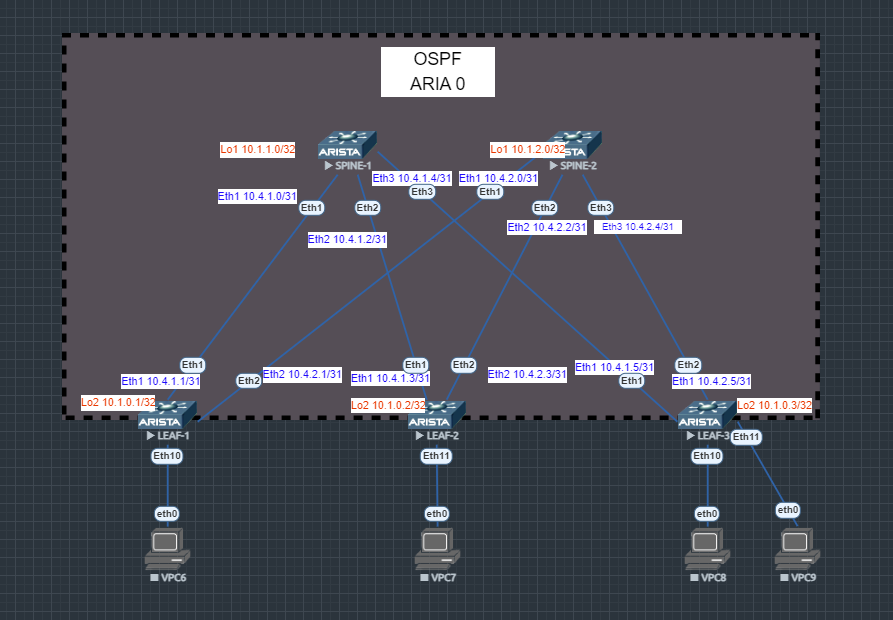

# Лабораторная работа №2
## Underlay. OSPF.

### Цель:

- Настроить протокол OSPF для Underlay сети
- Проверить связанность между устройствами

## Выполнение:

### Схема сети



### Таблица адресов

| hostname | interface |   IP/MASK   | Description  |
| :------: | :-------: | :----------: | :---------: |
|  LEAF-1  | Loopback2 | 10.2.0.1 /32 | OSPF        |
|  LEAF-1  |  eth 1    | 10.4.1.1 /31 | OSPF        |
|  LEAF-1  |  eth 2    | 10.4.2.1 /31 | OSPF        |
|          |           |              |             |
|  LEAF-2  | Loopback2 | 10.2.0.2 /32 | OSPF        |
|  LEAF-2  |  eth 1    | 10.4.1.3 /31 | OSPF        |
|  LEAF-2  |  eth 2    | 10.4.2.3 /31 | OSPF        |
|          |           |              |             |
|  LEAF-3  | Loopback2 | 10.2.0.3 /32 | OSPF        |
|  LEAF-3  |  eth 1    | 10.4.1.5 /31 | OSPF        |
|  LEAF-3  |  eth 2    | 10.4.2.5 /31 | OSPF        |
|          |           |              |             |
| SPINE-1  | Loopback1 | 10.1.1.0/32  | OSPF        |
| SPINE-1  |  eth 1    | 10.4.1.0/31  | OSPF        |
| SPINE-1  |  eth 2    | 10.4.1.2/31  | OSPF        |
| SPINE-1  |  eth 3    | 10.4.1.4/31  | OSPF        |
|           |          |              |             |
| SPINE-2  | Loopback1 | 10.1.2.0/32  | OSPF        |
| SPINE-2  |  eth 1    | 10.4.2.0/31  | OSPF        |
| SPINE-2  |  eth 2    | 10.4.2.2/31  | OSPF        |
| SPINE-2  |  eth 3    | 10.4.2.2/31  | OSPF        |
### Конфигурация оборудования
- #### LEAF-1
```
hostname LEAF-1
interface Ethernet1
   ip ospf network point-to-point
   ip ospf area 0.0.0.0
interface Ethernet2
   ip ospf network point-to-point
   ip ospf area 0.0.0.0
interface Loopback2
   ip ospf area 0.0.0.0
router ospf 1
   router-id 10.1.0.1
   passive-interface default
   no passive-interface Ethernet1
   no passive-interface Ethernet2
   no passive-interface Loopback2
   max-lsa 12000
ip ospf router-id output-format hostnames
```
- #### LEAF-2
```
hostname LEAF-2
interface Ethernet1
   ip ospf network point-to-point
   ip ospf area 0.0.0.0
interface Ethernet2
   ip ospf network point-to-point
   ip ospf area 0.0.0.0
interface Loopback2
   ip ospf area 0.0.0.0
router ospf 1
   router-id 10.1.0.2
   passive-interface default
   no passive-interface Ethernet1
   no passive-interface Ethernet2
   no passive-interface Loopback2
   max-lsa 12000
ip ospf router-id output-format hostnames
```
- #### LEAF-3
```
hostname LEAF-3
interface Ethernet1
   ip ospf network point-to-point
   ip ospf area 0.0.0.0
interface Ethernet2
   ip ospf network point-to-point
   ip ospf area 0.0.0.0
interface Loopback2
   ip ospf area 0.0.0.0
router ospf 1
   router-id 10.1.0.3
   passive-interface default
   no passive-interface Ethernet1
   no passive-interface Ethernet2
   no passive-interface Loopback2
   max-lsa 12000
ip ospf router-id output-format hostnames
```
- #### SPINE-1
```
hostname SPINE-1
interface Ethernet1
   ip ospf network point-to-point
   ip ospf area 0.0.0.0
interface Ethernet2
   ip ospf network point-to-point
   ip ospf area 0.0.0.0
interface Ethernet3
   ip ospf network point-to-point
   ip ospf area 0.0.0.0
interface Loopback1
   ip ospf area 0.0.0.0
router ospf 1
   router-id 10.1.1.0
   passive-interface default
   no passive-interface Ethernet1
   no passive-interface Ethernet2
   no passive-interface Ethernet3
   no passive-interface Loopback1
   max-lsa 12000
ip ospf router-id output-format hostnames
```
- #### SPINE-2
```
hostname SPINE-2
interface Ethernet1
   ip ospf network point-to-point
   ip ospf area 0.0.0.0
interface Ethernet2
   ip ospf network point-to-point
   ip ospf area 0.0.0.0
interface Ethernet3
   ip ospf network point-to-point
   ip ospf area 0.0.0.0
interface Loopback1
   ip ospf area 0.0.0.0
router ospf 1
   router-id 10.1.2.0
   passive-interface default
   no passive-interface Ethernet1
   no passive-interface Ethernet2
   no passive-interface Ethernet3
   no passive-interface Loopback1
   max-lsa 12000
ip ospf router-id output-format hostnames
```
### Проверка связанности устройств по протоколу OSPF
- #### SPINE-1
```
SPINE-1#sho ip os neighbor
Neighbor ID     Instance VRF      Pri State                  Dead Time   Address         Interface
10.1.0.1        1        default  0   FULL                   00:00:33    10.4.1.1        Ethernet1
10.1.0.2        1        default  0   FULL                   00:00:29    10.4.1.3        Ethernet2
10.1.0.3        1        default  0   FULL                   00:00:34    10.4.1.5        Ethernet3
```
- #### SPINE-2
```
SPINE-2#sho ip os neighbor
Neighbor ID     Instance VRF      Pri State                  Dead Time   Address         Interface
10.1.0.1        1        default  0   FULL                   00:00:37    10.4.2.1        Ethernet1
10.1.0.2        1        default  0   FULL                   00:00:34    10.4.2.3        Ethernet2
10.1.0.3        1        default  0   FULL                   00:00:34    10.4.2.5        Ethernet3
```