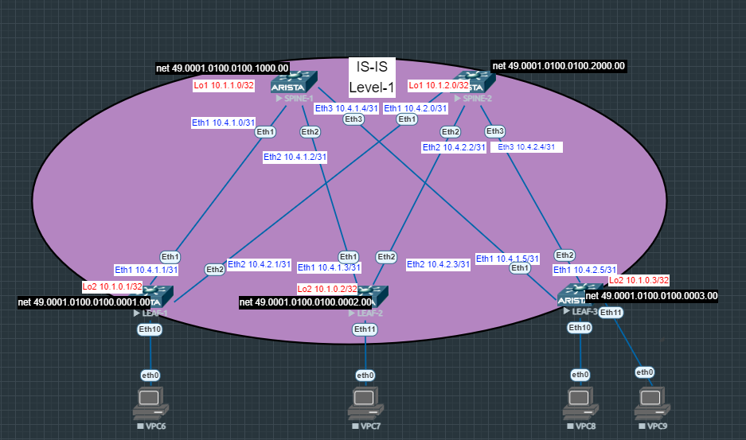

# Лабораторная работа №3
## Underlay. IS-IS.

### Цель:

- Настроить протокол IS-IS для Underlay сети
- Проверить связанность между устройствами

## Выполнение:

### Схема сети



### Конфигурация оборудования
- #### [SPINE-1](config/SPINE-1.conf)
```
interface Ethernet1
   description LEAF-1
   no switchport
   ip address 10.4.1.0/31
   isis enable Underlay
   isis circuit-type level-1
   no isis hello padding
   isis network point-to-point
   isis authentication mode md5
   isis authentication key 7 3nepWJZXHSM=
!
interface Ethernet2
   description LEAF-2
   no switchport
   ip address 10.4.1.2/31
   isis enable Underlay
   isis circuit-type level-1
   no isis hello padding
   isis network point-to-point
   isis authentication mode md5
   isis authentication key 7 3nepWJZXHSM=
!
interface Ethernet3
   description LEAF-3
   no switchport
   ip address 10.4.1.4/31
   isis enable Underlay
   isis circuit-type level-1
   no isis hello padding
   isis network point-to-point
   isis authentication mode md5
   isis authentication key 7 3nepWJZXHSM=
!
interface Loopback1
   ip address 10.1.1.0/32
   isis enable Underlay
   isis circuit-type level-1
   no isis hello padding
   isis network point-to-point
!
ip routing
!
router isis Underlay
   net 49.0001.0100.0100.1000.00
   is-type level-1
   log-adjacency-changes
   !
   address-family ipv4 unicast
```
- #### [SPINE-2](config/SPINE-2.conf)
```
interface Ethernet1
   description LEAF-1
   no switchport
   ip address 10.4.2.0/31
   isis enable Underlay
   isis circuit-type level-1
   no isis hello padding
   isis network point-to-point
   isis authentication mode md5
   isis authentication key 7 3nepWJZXHSM=
!
interface Ethernet2
   description LEAF-2
   no switchport
   ip address 10.4.2.2/31
   isis enable Underlay
   isis circuit-type level-1
   no isis hello padding
   isis network point-to-point
   isis authentication mode md5
   isis authentication key 7 3nepWJZXHSM=
!
interface Ethernet3
   description LEAF-3
   no switchport
   ip address 10.4.2.4/31
   isis enable Underlay
   isis circuit-type level-1
   no isis hello padding
   isis network point-to-point
   isis authentication mode md5
   isis authentication key 7 3nepWJZXHSM=
!
interface Loopback1
   ip address 10.1.2.0/32
   isis enable Underlay
   isis circuit-type level-1
   no isis hello padding
   isis network point-to-point
!
ip routing
!
router isis Underlay
   net 49.0001.0100.0100.2000.00
   is-type level-1
   log-adjacency-changes
   !
   address-family ipv4 unicast
```
- #### [LEAF-1](config/LEAF-1.conf)
```
interface Ethernet1
   description SPINE-1
   no switchport
   ip address 10.4.1.1/31
   isis enable Underlay
   isis circuit-type level-1
   no isis hello padding
   isis network point-to-point
   isis authentication mode md5
   isis authentication key 7 3nepWJZXHSM=
!
interface Ethernet2
   description SPINE-2
   no switchport
   ip address 10.4.2.1/31
   isis enable Underlay
   isis circuit-type level-1
   no isis hello padding
   isis network point-to-point
   isis authentication mode md5
   isis authentication key 7 3nepWJZXHSM=
!
interface Loopback2
   ip address 10.1.0.1/32
   isis enable Underlay
   isis circuit-type level-1
   no isis hello padding
   isis network point-to-point
!
ip routing
!
router isis Underlay
   net 49.0001.0100.0100.0001.00
   is-type level-1
   log-adjacency-changes
   !
   address-family ipv4 unicast
```
- #### [LEAF-2](config/LEAF-2.conf)
```
interface Ethernet1
   description SPINE-1
   no switchport
   ip address 10.4.1.3/31
   isis enable Underlay
   isis circuit-type level-1
   no isis hello padding
   isis network point-to-point
   isis authentication mode md5
   isis authentication key 7 3nepWJZXHSM=
!
interface Ethernet2
   description SPINE-2
   no switchport
   ip address 10.4.2.3/31
   isis enable Underlay
   isis circuit-type level-1
   no isis hello padding
   isis network point-to-point
   isis authentication mode md5
   isis authentication key 7 3nepWJZXHSM=
!
interface Loopback2
   ip address 10.1.0.2/32
   isis enable Underlay
   isis circuit-type level-1
   no isis hello padding
   isis network point-to-point
!
ip routing
!
router isis Underlay
   net 49.0001.0100.0100.0002.00
   is-type level-1
   !
   address-family ipv4 unicast
```
- #### [LEAF-3](config/LEAF-3.conf)

```
interface Ethernet1
   description SPINE-1
   no switchport
   ip address 10.4.1.5/31
   isis enable Underlay
   isis circuit-type level-1
   no isis hello padding
   isis network point-to-point
   isis authentication mode md5
   isis authentication key 7 3nepWJZXHSM=
!
interface Ethernet2
   description SPINE-2
   no switchport
   ip address 10.4.2.5/31
   isis enable Underlay
   isis circuit-type level-1
   no isis hello padding
   isis network point-to-point
   isis authentication mode md5
   isis authentication key 7 3nepWJZXHSM=
!
interface Loopback2
   ip address 10.1.0.3/32
   isis enable Underlay
   isis circuit-type level-1
   no isis hello padding
   isis network point-to-point
!
ip routing
!
router isis Underlay
   net 49.0001.0100.0100.0003.00
   is-type level-1
   !
   address-family ipv4 unicast
```
### Проверка связанности устройств по протоколу IS-IS
```
SPINE-1#sho isis neighbors
Instance  VRF      System Id        Type Interface          SNPA              State Hold time   Circuit Id
Underlay  default  LEAF-1           L1   Ethernet1          P2P               UP    25          1D
Underlay  default  LEAF-2           L1   Ethernet2          P2P               UP    29          1D
Underlay  default  LEAF-3           L1   Ethernet3          P2P               UP    25          1D

SPINE-1#sh ip route
Gateway of last resort is not set
 I L1     10.1.0.1/32 [115/20] via 10.4.1.1, Ethernet1
 I L1     10.1.0.2/32 [115/20] via 10.4.1.3, Ethernet2
 I L1     10.1.0.3/32 [115/20] via 10.4.1.5, Ethernet3
 C        10.1.1.0/32 is directly connected, Loopback1
 I L1     10.1.2.0/32 [115/30] via 10.4.1.1, Ethernet1
                               via 10.4.1.3, Ethernet2
                               via 10.4.1.5, Ethernet3
 C        10.4.1.0/31 is directly connected, Ethernet1
 C        10.4.1.2/31 is directly connected, Ethernet2
 C        10.4.1.4/31 is directly connected, Ethernet3
 I L1     10.4.2.0/31 [115/20] via 10.4.1.1, Ethernet1
 I L1     10.4.2.2/31 [115/20] via 10.4.1.3, Ethernet2
 I L1     10.4.2.4/31 [115/20] via 10.4.1.5, Ethernet3

```
```
SPINE-2#sho isis neighbors
Instance  VRF      System Id        Type Interface          SNPA              State Hold time   Circuit Id
Underlay  default  LEAF-1           L1   Ethernet1          P2P               UP    24          1E
Underlay  default  LEAF-2           L1   Ethernet2          P2P               UP    25          1E
Underlay  default  LEAF-3           L1   Ethernet3          P2P               UP    27          1E

SPINE-2#sh ip route
Gateway of last resort is not set
 I L1     10.1.0.1/32 [115/20] via 10.4.2.1, Ethernet1
 I L1     10.1.0.2/32 [115/20] via 10.4.2.3, Ethernet2
 I L1     10.1.0.3/32 [115/20] via 10.4.2.5, Ethernet3
 I L1     10.1.1.0/32 [115/30] via 10.4.2.1, Ethernet1
                               via 10.4.2.3, Ethernet2
                               via 10.4.2.5, Ethernet3
 C        10.1.2.0/32 is directly connected, Loopback1
 I L1     10.4.1.0/31 [115/20] via 10.4.2.1, Ethernet1
 I L1     10.4.1.2/31 [115/20] via 10.4.2.3, Ethernet2
 I L1     10.4.1.4/31 [115/20] via 10.4.2.5, Ethernet3
 C        10.4.2.0/31 is directly connected, Ethernet1
 C        10.4.2.2/31 is directly connected, Ethernet2
 C        10.4.2.4/31 is directly connected, Ethernet3
```
```
LEAF-1#sho isis neighbors
Instance  VRF      System Id        Type Interface          SNPA              State Hold time   Circuit Id
Underlay  default  SPINE-1          L1   Ethernet1          P2P               UP    22          1D
Underlay  default  SPINE-2          L1   Ethernet2          P2P               UP    23          1D

LEAF-1#sho ip ro
Gateway of last resort is not set
 C        10.1.0.1/32 is directly connected, Loopback2
 I L1     10.1.0.2/32 [115/30] via 10.4.1.0, Ethernet1
                               via 10.4.2.0, Ethernet2
 I L1     10.1.0.3/32 [115/30] via 10.4.1.0, Ethernet1
                               via 10.4.2.0, Ethernet2
 I L1     10.1.1.0/32 [115/20] via 10.4.1.0, Ethernet1
 I L1     10.1.2.0/32 [115/20] via 10.4.2.0, Ethernet2
 C        10.4.1.0/31 is directly connected, Ethernet1
 I L1     10.4.1.2/31 [115/20] via 10.4.1.0, Ethernet1
 I L1     10.4.1.4/31 [115/20] via 10.4.1.0, Ethernet1
 C        10.4.2.0/31 is directly connected, Ethernet2
 I L1     10.4.2.2/31 [115/20] via 10.4.2.0, Ethernet2
 I L1     10.4.2.4/31 [115/20] via 10.4.2.0, Ethernet2
```
```
LEAF-2#sho isis neighbors
Instance  VRF      System Id        Type Interface          SNPA              State Hold time   Circuit Id
Underlay  default  SPINE-1          L1   Ethernet1          P2P               UP    27          1E
Underlay  default  SPINE-2          L1   Ethernet2          P2P               UP    22          1E

LEAF-2#sho ip ro
Gateway of last resort is not set
 I L1     10.1.0.1/32 [115/30] via 10.4.1.2, Ethernet1
                               via 10.4.2.2, Ethernet2
 C        10.1.0.2/32 is directly connected, Loopback2
 I L1     10.1.0.3/32 [115/30] via 10.4.1.2, Ethernet1
                               via 10.4.2.2, Ethernet2
 I L1     10.1.1.0/32 [115/20] via 10.4.1.2, Ethernet1
 I L1     10.1.2.0/32 [115/20] via 10.4.2.2, Ethernet2
 I L1     10.4.1.0/31 [115/20] via 10.4.1.2, Ethernet1
 C        10.4.1.2/31 is directly connected, Ethernet1
 I L1     10.4.1.4/31 [115/20] via 10.4.1.2, Ethernet1
 I L1     10.4.2.0/31 [115/20] via 10.4.2.2, Ethernet2
 C        10.4.2.2/31 is directly connected, Ethernet2
 I L1     10.4.2.4/31 [115/20] via 10.4.2.2, Ethernet2
```
```
LEAF-3#sho isis neighbors
Instance  VRF      System Id        Type Interface          SNPA              State Hold time   Circuit Id
Underlay  default  SPINE-1          L1   Ethernet1          P2P               UP    21          1F
Underlay  default  SPINE-2          L1   Ethernet2          P2P               UP    22          1F

LEAF-3#sho ip ro
Gateway of last resort is not set
 I L1     10.1.0.1/32 [115/30] via 10.4.1.4, Ethernet1
                               via 10.4.2.4, Ethernet2
 I L1     10.1.0.2/32 [115/30] via 10.4.1.4, Ethernet1
                               via 10.4.2.4, Ethernet2
 C        10.1.0.3/32 is directly connected, Loopback2
 I L1     10.1.1.0/32 [115/20] via 10.4.1.4, Ethernet1
 I L1     10.1.2.0/32 [115/20] via 10.4.2.4, Ethernet2
 I L1     10.4.1.0/31 [115/20] via 10.4.1.4, Ethernet1
 I L1     10.4.1.2/31 [115/20] via 10.4.1.4, Ethernet1
 C        10.4.1.4/31 is directly connected, Ethernet1
 I L1     10.4.2.0/31 [115/20] via 10.4.2.4, Ethernet2
 I L1     10.4.2.2/31 [115/20] via 10.4.2.4, Ethernet2
 C        10.4.2.4/31 is directly connected, Ethernet2
```