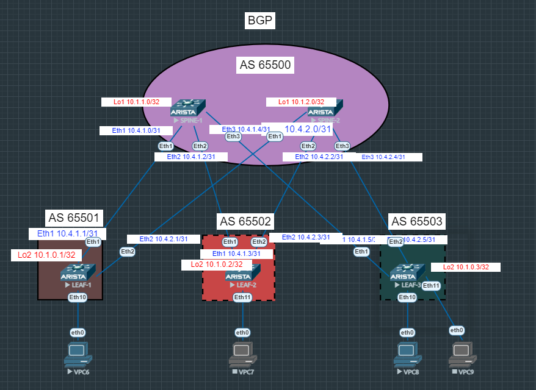

# Лабораторная работа №3
## Underlay. eBGP.

### Цель:

- Настроить протокол eBGP для Underlay сети
- Проверить связанность между устройствами

## Выполнение:

### Схема сети



### Конфигурация оборудования
- #### [SPINE-1](config/SPINE-1.conf)
```
interface Ethernet1
   description LEAF-1
   no switchport
   ip address 10.4.1.0/31
   bfd interval 100 min-rx 100 multiplier 3
!
interface Ethernet2
   description LEAF-2
   no switchport
   ip address 10.4.1.2/31
   bfd interval 100 min-rx 100 multiplier 3
!
interface Ethernet3
   description LEAF-3
   no switchport
   ip address 10.4.1.4/31
   bfd interval 100 min-rx 100 multiplier 3
!
router bgp 65500
   router-id 10.1.1.0
   timers bgp 3 9
   maximum-paths 2
   neighbor 10.4.1.1 remote-as 65501
   neighbor 10.4.1.3 remote-as 65502
   neighbor 10.4.1.5 remote-as 65503
   redistribute connected

```
- #### [SPINE-2](config/SPINE-2.conf)
```
interface Ethernet1
   description LEAF-1
   no switchport
   ip address 10.4.2.0/31
   bfd interval 100 min-rx 100 multiplier 3
!
interface Ethernet2
   description LEAF-2
   no switchport
   ip address 10.4.2.2/31
   bfd interval 100 min-rx 100 multiplier 3
!
interface Ethernet3
   description LEAF-3
   no switchport
   ip address 10.4.2.4/31
   bfd interval 100 min-rx 100 multiplier 3
!
router bgp 65500
   router-id 10.1.2.0
   timers bgp 3 9
   maximum-paths 2
   neighbor 10.4.2.1 remote-as 65501
   neighbor 10.4.2.3 remote-as 65502
   neighbor 10.4.2.5 remote-as 65503
   redistribute connected
!
end

```
- #### [LEAF-1](config/LEAF-1.conf)
```
interface Ethernet1
   description SPINE-1
   no switchport
   ip address 10.4.1.1/31
   bfd interval 100 min-rx 100 multiplier 3
!
interface Ethernet2
   description SPINE-2
   no switchport
   ip address 10.4.2.1/31
   bfd interval 100 min-rx 100 multiplier 3
!
router bgp 65501
   router-id 10.1.0.1
   timers bgp 3 9
   maximum-paths 2
   neighbor 10.4.1.0 remote-as 65500
   neighbor 10.4.2.0 remote-as 65500
   redistribute connected
```
- #### [LEAF-2](config/LEAF-2.conf)
```
interface Ethernet1
   description SPINE-1
   no switchport
   ip address 10.4.1.3/31
   bfd interval 100 min-rx 100 multiplier 3
!
interface Ethernet2
   description SPINE-2
   no switchport
   ip address 10.4.2.3/31
   bfd interval 100 min-rx 100 multiplier 3
!
router bgp 65502
   router-id 10.1.0.2
   timers bgp 3 9
   maximum-paths 2
   neighbor 10.4.1.2 remote-as 65500
   neighbor 10.4.2.2 remote-as 65500
   redistribute connected
```
- #### [LEAF-3](config/LEAF-3.conf)

```
interface Ethernet1
   description SPINE-1
   no switchport
   ip address 10.4.1.5/31
   bfd interval 100 min-rx 100 multiplier 3
!
interface Ethernet2
   description SPINE-2
   no switchport
   ip address 10.4.2.5/31
   bfd interval 100 min-rx 100 multiplier 3
!
router bgp 65503
   router-id 10.1.0.3
   timers bgp 3 9
   maximum-paths 2
   neighbor 10.4.1.4 remote-as 65500
   neighbor 10.4.2.4 remote-as 65500
   redistribute connected
```
### Проверка связанности устройств по протоколу BGP
```
SPINE-1#sho ip bgp  summary
BGP summary information for VRF default
Router identifier 10.1.1.0, local AS number 65500
Neighbor Status Codes: m - Under maintenance
  Neighbor         V  AS           MsgRcvd   MsgSent  InQ OutQ  Up/Down State   PfxRcd PfxAcc
  10.4.1.1         4  65501           1657      1650    0    0 01:20:01 Estab   3      3
  10.4.1.3         4  65502           1648      1643    0    0 01:20:01 Estab   3      3
  10.4.1.5         4  65503           1648      1636    0    0 01:20:01 Estab   3      3

SPINE-1#sho ip ro
Gateway of last resort is not set

 B E      10.1.0.1/32 [200/0] via 10.4.1.1, Ethernet1
 B E      10.1.0.2/32 [200/0] via 10.4.1.3, Ethernet2
 B E      10.1.0.3/32 [200/0] via 10.4.1.5, Ethernet3
 C        10.1.1.0/32 is directly connected, Loopback1
 C        10.4.1.0/31 is directly connected, Ethernet1
 C        10.4.1.2/31 is directly connected, Ethernet2
 C        10.4.1.4/31 is directly connected, Ethernet3
 B E      10.4.2.0/31 [200/0] via 10.4.1.1, Ethernet1
 B E      10.4.2.2/31 [200/0] via 10.4.1.3, Ethernet2
 B E      10.4.2.4/31 [200/0] via 10.4.1.5, Ethernet3
```
```
SPINE-2#sho ip bgp  summary
sBGP summary information for VRF default
Router identifier 10.1.2.0, local AS number 65500
Neighbor Status Codes: m - Under maintenance
  Neighbor         V  AS           MsgRcvd   MsgSent  InQ OutQ  Up/Down State   PfxRcd PfxAcc
  10.4.2.1         4  65501            459       450    0    0 00:17:13 Estab   3      3
  10.4.2.3         4  65502            450       440    0    0 00:17:13 Estab   3      3
  10.4.2.5         4  65503            452       437    0    0 00:17:13 Estab   3      3

SPINE-2#sho ip ro
Gateway of last resort is not set

 B E      10.1.0.1/32 [200/0] via 10.4.2.1, Ethernet1
 B E      10.1.0.2/32 [200/0] via 10.4.2.3, Ethernet2
 B E      10.1.0.3/32 [200/0] via 10.4.2.5, Ethernet3
 C        10.1.2.0/32 is directly connected, Loopback1
 B E      10.4.1.0/31 [200/0] via 10.4.2.1, Ethernet1
 B E      10.4.1.2/31 [200/0] via 10.4.2.3, Ethernet2
 B E      10.4.1.4/31 [200/0] via 10.4.2.5, Ethernet3
 C        10.4.2.0/31 is directly connected, Ethernet1
 C        10.4.2.2/31 is directly connected, Ethernet2
 C        10.4.2.4/31 is directly connected, Ethernet3
```
```
LEAF-1#   sho ip bgp  summary
BGP summary information for VRF default
Router identifier 10.1.0.1, local AS number 65501
Neighbor Status Codes: m - Under maintenance
  Neighbor         V  AS           MsgRcvd   MsgSent  InQ OutQ  Up/Down State   PfxRcd PfxAcc
  10.4.1.0         4  65500           1718      1727    0    0 01:22:06 Estab   8      8
  10.4.2.0         4  65500            467       481    0    0 00:18:14 Estab   8      8

LEAF-1#sho ip ro
Gateway of last resort is not set

 C        10.1.0.1/32 is directly connected, Loopback2
 B E      10.1.0.2/32 [200/0] via 10.4.1.0, Ethernet1
                              via 10.4.2.0, Ethernet2
 B E      10.1.0.3/32 [200/0] via 10.4.1.0, Ethernet1
                              via 10.4.2.0, Ethernet2
 B E      10.1.1.0/32 [200/0] via 10.4.1.0, Ethernet1
 B E      10.1.2.0/32 [200/0] via 10.4.2.0, Ethernet2
 C        10.4.1.0/31 is directly connected, Ethernet1
 B E      10.4.1.2/31 [200/0] via 10.4.1.0, Ethernet1
 B E      10.4.1.4/31 [200/0] via 10.4.1.0, Ethernet1
 C        10.4.2.0/31 is directly connected, Ethernet2
 B E      10.4.2.2/31 [200/0] via 10.4.2.0, Ethernet2
 B E      10.4.2.4/31 [200/0] via 10.4.2.0, Ethernet2

 LEAF-1#ping 10.1.0.2
PING 10.1.0.2 (10.1.0.2) 72(100) bytes of data.
80 bytes from 10.1.0.2: icmp_seq=1 ttl=63 time=9.36 ms
80 bytes from 10.1.0.2: icmp_seq=2 ttl=63 time=7.70 ms
80 bytes from 10.1.0.2: icmp_seq=3 ttl=63 time=7.35 ms
80 bytes from 10.1.0.2: icmp_seq=4 ttl=63 time=8.17 ms
80 bytes from 10.1.0.2: icmp_seq=5 ttl=63 time=8.59 ms

--- 10.1.0.2 ping statistics ---
5 packets transmitted, 5 received, 0% packet loss, time 41ms
rtt min/avg/max/mdev = 7.350/8.236/9.360/0.706 ms, ipg/ewma 10.436/8.803 ms
```
```
LEAF-2#   sho ip bgp  summary
BGP summary information for VRF default
Router identifier 10.1.0.2, local AS number 65502
Neighbor Status Codes: m - Under maintenance
  Neighbor         V  AS           MsgRcvd   MsgSent  InQ OutQ  Up/Down State   PfxRcd PfxAcc
  10.4.1.2         4  65500           1702      1707    0    0 01:22:57 Estab   8      8
  10.4.2.2         4  65500            548       559    0    0 00:19:04 Estab   8      8

LEAF-2#sho ip ro
Gateway of last resort is not set

 B E      10.1.0.1/32 [200/0] via 10.4.1.2, Ethernet1
                              via 10.4.2.2, Ethernet2
 C        10.1.0.2/32 is directly connected, Loopback2
 B E      10.1.0.3/32 [200/0] via 10.4.1.2, Ethernet1
                              via 10.4.2.2, Ethernet2
 B E      10.1.1.0/32 [200/0] via 10.4.1.2, Ethernet1
 B E      10.1.2.0/32 [200/0] via 10.4.2.2, Ethernet2
 B E      10.4.1.0/31 [200/0] via 10.4.1.2, Ethernet1
 C        10.4.1.2/31 is directly connected, Ethernet1
 B E      10.4.1.4/31 [200/0] via 10.4.1.2, Ethernet1
 B E      10.4.2.0/31 [200/0] via 10.4.2.2, Ethernet2
 C        10.4.2.2/31 is directly connected, Ethernet2
 B E      10.4.2.4/31 [200/0] via 10.4.2.2, Ethernet2

LEAF-2#ping 10.1.0.3
PING 10.1.0.3 (10.1.0.3) 72(100) bytes of data.
80 bytes from 10.1.0.3: icmp_seq=1 ttl=63 time=8.01 ms
80 bytes from 10.1.0.3: icmp_seq=2 ttl=63 time=6.74 ms
80 bytes from 10.1.0.3: icmp_seq=3 ttl=63 time=6.44 ms
80 bytes from 10.1.0.3: icmp_seq=4 ttl=63 time=7.02 ms
80 bytes from 10.1.0.3: icmp_seq=5 ttl=63 time=8.18 ms

--- 10.1.0.3 ping statistics ---
5 packets transmitted, 5 received, 0% packet loss, time 33ms
rtt min/avg/max/mdev = 6.440/7.282/8.185/0.702 ms, ipg/ewma 8.430/7.670 ms
```
```
LEAF-3#sho ip bgp  su
BGP summary information for VRF default
Router identifier 10.1.0.3, local AS number 65503
Neighbor Status Codes: m - Under maintenance
  Neighbor         V  AS           MsgRcvd   MsgSent  InQ OutQ  Up/Down State   PfxRcd PfxAcc
  10.4.1.4         4  65500           1706      1718    0    0 01:23:30 Estab   8      8
  10.4.2.4         4  65500            529       544    0    0 00:19:37 Estab   8      8

LEAF-3#sho ip route
Gateway of last resort is not set

 B E      10.1.0.1/32 [200/0] via 10.4.1.4, Ethernet1
                              via 10.4.2.4, Ethernet2
 B E      10.1.0.2/32 [200/0] via 10.4.1.4, Ethernet1
                              via 10.4.2.4, Ethernet2
 C        10.1.0.3/32 is directly connected, Loopback2
 B E      10.1.1.0/32 [200/0] via 10.4.1.4, Ethernet1
 B E      10.1.2.0/32 [200/0] via 10.4.2.4, Ethernet2
 B E      10.4.1.0/31 [200/0] via 10.4.1.4, Ethernet1
 B E      10.4.1.2/31 [200/0] via 10.4.1.4, Ethernet1
 C        10.4.1.4/31 is directly connected, Ethernet1
 B E      10.4.2.0/31 [200/0] via 10.4.2.4, Ethernet2
 B E      10.4.2.2/31 [200/0] via 10.4.2.4, Ethernet2
 C        10.4.2.4/31 is directly connected, Ethernet2

LEAF-3#ping 10.1.0.1
PING 10.1.0.1 (10.1.0.1) 72(100) bytes of data.
80 bytes from 10.1.0.1: icmp_seq=1 ttl=63 time=8.34 ms
80 bytes from 10.1.0.1: icmp_seq=2 ttl=63 time=7.89 ms
80 bytes from 10.1.0.1: icmp_seq=3 ttl=63 time=7.80 ms
80 bytes from 10.1.0.1: icmp_seq=4 ttl=63 time=7.79 ms
80 bytes from 10.1.0.1: icmp_seq=5 ttl=63 time=7.63 ms

--- 10.1.0.1 ping statistics ---
5 packets transmitted, 5 received, 0% packet loss, time 37ms
rtt min/avg/max/mdev = 7.636/7.897/8.347/0.252 ms, ipg/ewma 9.272/8.109 ms
```