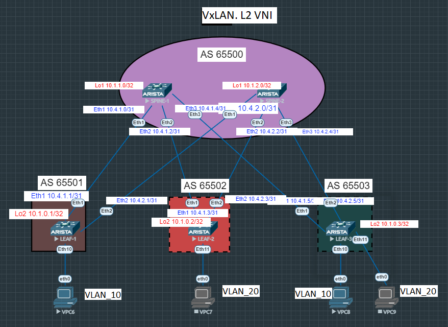

# Лабораторная работа №3
## Overlay. VxLAN EVPN для L2.

### Цель:

- Настроите BGP peering между Leaf и Spine в AF l2vpn evpn
- Настроите связанность между клиентами в первой зоне и убедитесь в её наличии
- 

## Выполнение:

### Схема сети



### Конфигурация оборудования
- #### [SPINE-1](config/SPINE-1.conf)
```
router bgp 65500
   router-id 10.1.1.0
   timers bgp 3 9
   maximum-paths 10
   neighbor 10.1.0.1 remote-as 65501
   neighbor 10.1.0.1 next-hop-unchanged
   neighbor 10.1.0.1 update-source Loopback1
   neighbor 10.1.0.1 ebgp-multihop 3
   neighbor 10.1.0.1 send-community extended
   neighbor 10.1.0.2 remote-as 65502
   neighbor 10.1.0.2 next-hop-unchanged
   neighbor 10.1.0.2 update-source Loopback1
   neighbor 10.1.0.2 ebgp-multihop 3
   neighbor 10.1.0.2 send-community extended
   neighbor 10.1.0.3 remote-as 65503
   neighbor 10.1.0.3 next-hop-unchanged
   neighbor 10.1.0.3 update-source Loopback1
   neighbor 10.1.0.3 ebgp-multihop 3
   neighbor 10.1.0.3 send-community extended
   neighbor 10.4.1.1 remote-as 65501
   neighbor 10.4.1.1 rib-in pre-policy retain all
   neighbor 10.4.1.1 send-community
   neighbor 10.4.1.1 maximum-routes 1000
   neighbor 10.4.1.3 remote-as 65502
   neighbor 10.4.1.3 rib-in pre-policy retain all
   neighbor 10.4.1.3 send-community
   neighbor 10.4.1.3 maximum-routes 1000
   neighbor 10.4.1.5 remote-as 65503
   neighbor 10.4.1.5 rib-in pre-policy retain all
   neighbor 10.4.1.5 send-community
   neighbor 10.4.1.5 maximum-routes 1000
   redistribute connected
   !
   address-family evpn
      neighbor 10.1.0.1 activate
      neighbor 10.1.0.2 activate
      neighbor 10.1.0.3 activate
   !
   address-family ipv4
      neighbor 10.4.1.1 activate
      neighbor 10.4.1.3 activate
      neighbor 10.4.1.5 activate
!
end
```
- #### [SPINE-2](config/SPINE-2.conf)
```
router bgp 65500
   router-id 10.1.2.0
   timers bgp 3 9
   maximum-paths 10
   neighbor 10.1.0.1 remote-as 65501
   neighbor 10.1.0.1 next-hop-unchanged
   neighbor 10.1.0.1 update-source Loopback1
   neighbor 10.1.0.1 ebgp-multihop 3
   neighbor 10.1.0.1 send-community extended
   neighbor 10.1.0.2 remote-as 65502
   neighbor 10.1.0.2 next-hop-unchanged
   neighbor 10.1.0.2 update-source Loopback1
   neighbor 10.1.0.2 ebgp-multihop 3
   neighbor 10.1.0.2 send-community extended
   neighbor 10.1.0.3 remote-as 65503
   neighbor 10.1.0.3 next-hop-unchanged
   neighbor 10.1.0.3 update-source Loopback1
   neighbor 10.1.0.3 ebgp-multihop 3
   neighbor 10.1.0.3 send-community extended
   neighbor 10.4.2.1 remote-as 65501
   neighbor 10.4.2.1 rib-in pre-policy retain all
   neighbor 10.4.2.1 send-community
   neighbor 10.4.2.1 maximum-routes 1000
   neighbor 10.4.2.3 remote-as 65502
   neighbor 10.4.2.3 rib-in pre-policy retain all
   neighbor 10.4.2.3 send-community
   neighbor 10.4.2.3 maximum-routes 1000
   neighbor 10.4.2.5 remote-as 65503
   neighbor 10.4.2.5 rib-in pre-policy retain all
   neighbor 10.4.2.5 send-community
   neighbor 10.4.2.5 maximum-routes 1000
   redistribute connected
   !
   address-family evpn
      neighbor 10.1.0.1 activate
      neighbor 10.1.0.2 activate
      neighbor 10.1.0.3 activate
   !
   address-family ipv4
      neighbor 10.4.2.1 activate
      neighbor 10.4.2.3 activate
      neighbor 10.4.2.5 activate
!
end
```
- #### [LEAF-1](config/LEAF-1.conf)
```
vlan 10,20
!
interface Ethernet10
   description to-client-1
   switchport access vlan 10
!
interface Loopback100
   description NVE Loopback
   ip address 10.100.0.1/32
!
interface Management1
!
interface Vxlan1
   vxlan source-interface Loopback100
   vxlan udp-port 4789
   vxlan vlan 10 vni 10010
   vxlan learn-restrict any
!
router bgp 65501
   router-id 10.1.0.1
   timers bgp 3 9
   maximum-paths 3 ecmp 3
   neighbor 10.1.1.0 remote-as 65500
   neighbor 10.1.1.0 update-source Loopback2
   neighbor 10.1.1.0 ebgp-multihop 3
   neighbor 10.1.1.0 send-community extended
   neighbor 10.1.2.0 remote-as 65500
   neighbor 10.1.2.0 update-source Loopback2
   neighbor 10.1.2.0 ebgp-multihop 3
   neighbor 10.1.2.0 send-community extended
   neighbor 10.4.1.0 remote-as 65500
   neighbor 10.4.1.0 allowas-in 1
   neighbor 10.4.1.0 rib-in pre-policy retain all
   neighbor 10.4.1.0 send-community extended
   neighbor 10.4.1.0 maximum-routes 1000
   neighbor 10.4.2.0 remote-as 65500
   neighbor 10.4.2.0 allowas-in 1
   neighbor 10.4.2.0 rib-in pre-policy retain all
   neighbor 10.4.2.0 send-community extended
   neighbor 10.4.2.0 maximum-routes 1000
   redistribute connected
   !
   vlan 10
      rd 65501:10010
      route-target both 10:10010
      redistribute learned
   !
   vlan 20
      rd 65501:10020
      route-target both 20:10020
      redistribute learned
   !
   address-family evpn
      neighbor 10.1.1.0 activate
      neighbor 10.1.2.0 activate
   !
   address-family ipv4
      neighbor 10.4.1.0 activate
      neighbor 10.4.2.0 activate
!
end
```
- #### [LEAF-2](config/LEAF-2.conf)
```
vlan 10,20
!
interface Ethernet11
   description to-client-2
   switchport access vlan 20
!
interface Loopback100
   description NVE Loopback
   ip address 10.100.0.2/32
!
interface Management1
!
interface Vxlan1
   vxlan source-interface Loopback100
   vxlan udp-port 4789
   vxlan vlan 10 vni 10010
   vxlan vlan 20 vni 10020
   vxlan learn-restrict any
!
router bgp 65502
   router-id 10.1.0.2
   timers bgp 3 9
   maximum-paths 3 ecmp 3
   neighbor 10.1.1.0 remote-as 65500
   neighbor 10.1.1.0 update-source Loopback2
   neighbor 10.1.1.0 ebgp-multihop 3
   neighbor 10.1.1.0 send-community extended
   neighbor 10.1.2.0 remote-as 65500
   neighbor 10.1.2.0 update-source Loopback2
   neighbor 10.1.2.0 ebgp-multihop 3
   neighbor 10.1.2.0 send-community extended
   neighbor 10.4.1.2 remote-as 65500
   neighbor 10.4.1.2 allowas-in 1
   neighbor 10.4.1.2 rib-in pre-policy retain all
   neighbor 10.4.1.2 send-community extended
   neighbor 10.4.1.2 maximum-routes 1000
   neighbor 10.4.2.2 remote-as 65500
   neighbor 10.4.2.2 allowas-in 1
   neighbor 10.4.2.2 rib-in pre-policy retain all
   neighbor 10.4.2.2 send-community extended
   neighbor 10.4.2.2 maximum-routes 1000
   redistribute connected
   !
   vlan 10
      rd 65502:10010
      route-target both 10:10010
      redistribute learned
   !
   vlan 20
      rd 65502:10020
      route-target both 20:10020
      redistribute learned
   !
   address-family evpn
      neighbor 10.1.1.0 activate
      neighbor 10.1.2.0 activate
   !
   address-family ipv4
      neighbor 10.4.1.2 activate
      neighbor 10.4.2.2 activate
!
end
```
- #### [LEAF-3](config/LEAF-3.conf)
```
vlan 10,20
!
interface Ethernet10
   description to-client-1
   switchport access vlan 10
!
interface Ethernet11
   description to-client-2
   switchport access vlan 20
!
interface Loopback100
   description NVE Loopback
   ip address 10.100.0.3/32
!
interface Vxlan1
   vxlan source-interface Loopback100
   vxlan udp-port 4789
   vxlan vlan 10 vni 10010
   vxlan vlan 20 vni 10020
   vxlan learn-restrict any
!
ip routing
!
router bgp 65503
   router-id 10.1.0.3
   timers bgp 3 9
   maximum-paths 3 ecmp 3
   neighbor 10.1.1.0 remote-as 65500
   neighbor 10.1.1.0 update-source Loopback2
   neighbor 10.1.1.0 ebgp-multihop 3
   neighbor 10.1.1.0 send-community extended
   neighbor 10.1.2.0 remote-as 65500
   neighbor 10.1.2.0 update-source Loopback2
   neighbor 10.1.2.0 ebgp-multihop 3
   neighbor 10.1.2.0 send-community extended
   neighbor 10.4.1.4 remote-as 65500
   neighbor 10.4.1.4 allowas-in 1
   neighbor 10.4.1.4 rib-in pre-policy retain all
   neighbor 10.4.1.4 send-community extended
   neighbor 10.4.1.4 maximum-routes 1000
   neighbor 10.4.2.4 remote-as 65500
   neighbor 10.4.2.4 allowas-in 1
   neighbor 10.4.2.4 rib-in pre-policy retain all
   neighbor 10.4.2.4 send-community extended
   neighbor 10.4.2.4 maximum-routes 1000
   redistribute connected
   !
   vlan 10
      rd 65503:10010
      route-target both 10:10010
      redistribute learned
   !
   vlan 20
      rd 65503:10020
      route-target both 20:10020
      redistribute learned
   !
   address-family evpn
      neighbor 10.1.1.0 activate
      neighbor 10.1.2.0 activate
   !
   address-family ipv4
      neighbor 10.4.1.4 activate
      neighbor 10.4.2.4 activate
```
### Проверка связанности устройств в VxLAN EVPN для L2.
```
LEAF-1#sho mac address-table
          Mac Address Table
------------------------------------------------------------------

Vlan    Mac Address       Type        Ports      Moves   Last Move
----    -----------       ----        -----      -----   ---------
  10    0050.7966.6806    DYNAMIC     Et10       1       0:00:11 ago
  10    0050.7966.6808    DYNAMIC     Vx1        1       0:00:11 ago
Total Mac Addresses for this criterion: 2
```
```
LEAF-2#sho mac address-table
          Mac Address Table
------------------------------------------------------------------

Vlan    Mac Address       Type        Ports      Moves   Last Move
----    -----------       ----        -----      -----   ---------
  10    0050.7966.6806    DYNAMIC     Vx1        1       0:00:31 ago
  10    0050.7966.6808    DYNAMIC     Vx1        1       0:00:31 ago
  20    0050.7966.6807    DYNAMIC     Et11       1       0:00:27 ago
  20    0050.7966.6809    DYNAMIC     Vx1        1       0:00:27 ago
Total Mac Addresses for this criterion: 4
```
```
LEAF-3#sho mac address-table
          Mac Address Table
------------------------------------------------------------------

Vlan    Mac Address       Type        Ports      Moves   Last Move
----    -----------       ----        -----      -----   ---------
  10    0050.7966.6806    DYNAMIC     Vx1        1       0:07:34 ago
  10    0050.7966.6808    DYNAMIC     Et10       1       0:07:34 ago
  20    0050.7966.6807    DYNAMIC     Vx1        1       0:07:34 ago
  20    0050.7966.6809    DYNAMIC     Et11       1       0:07:34 ago
Total Mac Addresses for this criterion: 4
```