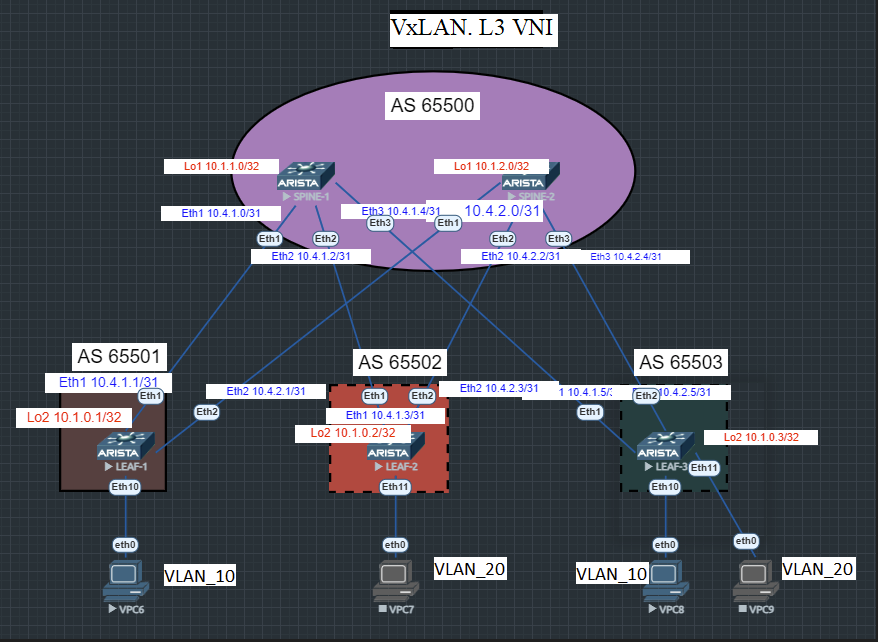

# Лабораторная работа №6
## Overlay. VxLAN. L3VNI.

### Цель:

- Настроить маршрутизацию в рамках Overlay между клиентами
- Настроите каждого клиента в своем VNI
- Настроите маршрутизацию между клиентами

## Выполнение:

### Схема сети



### Конфигурация оборудования

<details>
<summary>spine-1</summary>

- #### [SPINE-1](config/SPINE-1.conf)
```
router bgp 65500
   router-id 10.1.1.0
   timers bgp 3 9
   maximum-paths 10
   neighbor 10.1.0.1 remote-as 65501
   neighbor 10.1.0.1 next-hop-unchanged
   neighbor 10.1.0.1 update-source Loopback1
   neighbor 10.1.0.1 ebgp-multihop 3
   neighbor 10.1.0.1 send-community extended
   neighbor 10.1.0.2 remote-as 65502
   neighbor 10.1.0.2 next-hop-unchanged
   neighbor 10.1.0.2 update-source Loopback1
   neighbor 10.1.0.2 ebgp-multihop 3
   neighbor 10.1.0.2 send-community extended
   neighbor 10.1.0.3 remote-as 65503
   neighbor 10.1.0.3 next-hop-unchanged
   neighbor 10.1.0.3 update-source Loopback1
   neighbor 10.1.0.3 ebgp-multihop 3
   neighbor 10.1.0.3 send-community extended
   neighbor 10.4.1.1 remote-as 65501
   neighbor 10.4.1.1 rib-in pre-policy retain all
   neighbor 10.4.1.1 send-community
   neighbor 10.4.1.1 maximum-routes 1000
   neighbor 10.4.1.3 remote-as 65502
   neighbor 10.4.1.3 rib-in pre-policy retain all
   neighbor 10.4.1.3 send-community
   neighbor 10.4.1.3 maximum-routes 1000
   neighbor 10.4.1.5 remote-as 65503
   neighbor 10.4.1.5 rib-in pre-policy retain all
   neighbor 10.4.1.5 send-community
   neighbor 10.4.1.5 maximum-routes 1000
   redistribute connected
   !
   address-family evpn
      neighbor 10.1.0.1 activate
      neighbor 10.1.0.2 activate
      neighbor 10.1.0.3 activate
   !
   address-family ipv4
      neighbor 10.4.1.1 activate
      neighbor 10.4.1.3 activate
      neighbor 10.4.1.5 activate
!
end
```
</details>

<details>
<summary>spine-2</summary>

- #### [SPINE-2](config/SPINE-2.conf)
```
router bgp 65500
   router-id 10.1.2.0
   timers bgp 3 9
   maximum-paths 10
   neighbor 10.1.0.1 remote-as 65501
   neighbor 10.1.0.1 next-hop-unchanged
   neighbor 10.1.0.1 update-source Loopback1
   neighbor 10.1.0.1 ebgp-multihop 3
   neighbor 10.1.0.1 send-community extended
   neighbor 10.1.0.2 remote-as 65502
   neighbor 10.1.0.2 next-hop-unchanged
   neighbor 10.1.0.2 update-source Loopback1
   neighbor 10.1.0.2 ebgp-multihop 3
   neighbor 10.1.0.2 send-community extended
   neighbor 10.1.0.3 remote-as 65503
   neighbor 10.1.0.3 next-hop-unchanged
   neighbor 10.1.0.3 update-source Loopback1
   neighbor 10.1.0.3 ebgp-multihop 3
   neighbor 10.1.0.3 send-community extended
   neighbor 10.4.2.1 remote-as 65501
   neighbor 10.4.2.1 rib-in pre-policy retain all
   neighbor 10.4.2.1 send-community
   neighbor 10.4.2.1 maximum-routes 1000
   neighbor 10.4.2.3 remote-as 65502
   neighbor 10.4.2.3 rib-in pre-policy retain all
   neighbor 10.4.2.3 send-community
   neighbor 10.4.2.3 maximum-routes 1000
   neighbor 10.4.2.5 remote-as 65503
   neighbor 10.4.2.5 rib-in pre-policy retain all
   neighbor 10.4.2.5 send-community
   neighbor 10.4.2.5 maximum-routes 1000
   redistribute connected
   !
   address-family evpn
      neighbor 10.1.0.1 activate
      neighbor 10.1.0.2 activate
      neighbor 10.1.0.3 activate
   !
   address-family ipv4
      neighbor 10.4.2.1 activate
      neighbor 10.4.2.3 activate
      neighbor 10.4.2.5 activate
!
end
```
</details>

<details>
<summary>leaf-1</summary>

- #### [LEAF-1](config/LEAF-1.conf)
```
interface Loopback2
   ip address 10.1.0.1/32
!
interface Loopback100
   description NVE Loopback
   ip address 10.100.0.1/32
!
interface Management1
!
interface Vlan20
   vrf OTUS-L3
   ip address virtual 172.16.0.254/24
!
interface Vxlan1
   vxlan source-interface Loopback100
   vxlan udp-port 4789
   vxlan vlan 10 vni 10010
   vxlan vlan 20 vni 10020
   vxlan vrf OTUS-L3 vni 444
   vxlan learn-restrict any
!
ip virtual-router mac-address 00:00:00:00:00:01
!
ip routing
ip routing vrf OTUS-L3
!
router bgp 65501
   router-id 10.1.0.1
   timers bgp 3 9
   maximum-paths 3 ecmp 3
   neighbor 10.1.1.0 remote-as 65500
   neighbor 10.1.1.0 update-source Loopback2
   neighbor 10.1.1.0 ebgp-multihop 3
   neighbor 10.1.1.0 send-community extended
   neighbor 10.1.2.0 remote-as 65500
   neighbor 10.1.2.0 update-source Loopback2
   neighbor 10.1.2.0 ebgp-multihop 3
   neighbor 10.1.2.0 send-community extended
   neighbor 10.4.1.0 remote-as 65500
   neighbor 10.4.1.0 allowas-in 1
   neighbor 10.4.1.0 rib-in pre-policy retain all
   neighbor 10.4.1.0 send-community extended
   neighbor 10.4.1.0 maximum-routes 1000
   neighbor 10.4.2.0 remote-as 65500
   neighbor 10.4.2.0 allowas-in 1
   neighbor 10.4.2.0 rib-in pre-policy retain all
   neighbor 10.4.2.0 send-community extended
   neighbor 10.4.2.0 maximum-routes 1000
   redistribute connected
   !
   vlan 10
      rd 65501:10010
      route-target both 10:10010
      redistribute learned
   !
   vlan 20
      rd 65501:10020
      route-target both 20:10020
      redistribute learned
   !
   address-family evpn
      neighbor 10.1.1.0 activate
      neighbor 10.1.2.0 activate
   !
   address-family ipv4
      neighbor 10.4.1.0 activate
      neighbor 10.4.2.0 activate
   !
   vrf OTUS-L3
      rd 65501:444
      route-target import evpn 444:444
      route-target export evpn 444:444
!
end
```
</details>

<details>
<summary>leaf-2</summary>

- #### [LEAF-2](config/LEAF-2.conf)
```
vlan 10,20
!
vrf instance OTUS-L3
!
interface Ethernet11
   description to-client-2
   switchport access vlan 20
!
interface Loopback2
   ip address 10.1.0.2/32
!
interface Loopback100
   description NVE Loopback
   ip address 10.100.0.2/32
!
interface Management1
!
interface Vlan10
   vrf OTUS-L3
   ip address virtual 192.168.0.254/24
!
interface Vlan20
   vrf OTUS-L3
   ip address virtual 172.16.0.254/24
!
interface Vxlan1
   vxlan source-interface Loopback100
   vxlan udp-port 4789
   vxlan vlan 10 vni 10010
   vxlan vlan 20 vni 10020
   vxlan vrf OTUS-L3 vni 444
   vxlan learn-restrict any
!
ip virtual-router mac-address 00:00:00:00:00:02
!
ip routing
ip routing vrf OTUS-L3
!
router bgp 65502
   router-id 10.1.0.2
   timers bgp 3 9
   maximum-paths 3 ecmp 3
   neighbor 10.1.1.0 remote-as 65500
   neighbor 10.1.1.0 update-source Loopback2
   neighbor 10.1.1.0 ebgp-multihop 3
   neighbor 10.1.1.0 send-community extended
   neighbor 10.1.2.0 remote-as 65500
   neighbor 10.1.2.0 update-source Loopback2
   neighbor 10.1.2.0 ebgp-multihop 3
   neighbor 10.1.2.0 send-community extended
   neighbor 10.4.1.2 remote-as 65500
   neighbor 10.4.1.2 allowas-in 1
   neighbor 10.4.1.2 rib-in pre-policy retain all
   neighbor 10.4.1.2 send-community extended
   neighbor 10.4.1.2 maximum-routes 1000
   neighbor 10.4.2.2 remote-as 65500
   neighbor 10.4.2.2 allowas-in 1
   neighbor 10.4.2.2 rib-in pre-policy retain all
   neighbor 10.4.2.2 send-community extended
   neighbor 10.4.2.2 maximum-routes 1000
   redistribute connected
   !
   vlan 10
      rd 65502:10010
      route-target both 10:10010
      redistribute learned
   !
   vlan 20
      rd 65502:10020
      route-target both 20:10020
      redistribute learned
   !
   address-family evpn
      neighbor 10.1.1.0 activate
      neighbor 10.1.2.0 activate
   !
   address-family ipv4
      neighbor 10.4.1.2 activate
      neighbor 10.4.2.2 activate
   !
   vrf OTUS-L3
      rd 65502:444
      route-target import evpn 444:444
      route-target export evpn 444:444
!
end
```
</details>

<details>
<summary>leaf-3</summary>

- #### [LEAF-3](config/LEAF-3.conf)
```
vlan 10,20
!
vrf instance OTUS-L3
!
interface Ethernet10
   description to-client-1
   switchport access vlan 10
!
interface Ethernet11
   description to-client-2
   switchport access vlan 20
!
interface Loopback2
   ip address 10.1.0.3/32
!
interface Loopback100
   description NVE Loopback
   ip address 10.100.0.3/32
!
interface Management1
!
interface Vlan10
   vrf OTUS-L3
   ip address virtual 192.168.0.254/24
!
interface Vlan20
   vrf OTUS-L3
   ip address virtual 172.16.0.254/24
!
interface Vxlan1
   vxlan source-interface Loopback100
   vxlan udp-port 4789
   vxlan vlan 10 vni 10010
   vxlan vlan 20 vni 10020
   vxlan vrf OTUS-L3 vni 444
   vxlan learn-restrict any
!
ip virtual-router mac-address 00:00:00:00:00:03
!
ip routing
ip routing vrf OTUS-L3
!
router bgp 65503
   router-id 10.1.0.3
   timers bgp 3 9
   maximum-paths 3 ecmp 3
   neighbor 10.1.1.0 remote-as 65500
   neighbor 10.1.1.0 update-source Loopback2
   neighbor 10.1.1.0 ebgp-multihop 3
   neighbor 10.1.1.0 send-community extended
   neighbor 10.1.2.0 remote-as 65500
   neighbor 10.1.2.0 update-source Loopback2
   neighbor 10.1.2.0 ebgp-multihop 3
   neighbor 10.1.2.0 send-community extended
   neighbor 10.4.1.4 remote-as 65500
   neighbor 10.4.1.4 allowas-in 1
   neighbor 10.4.1.4 rib-in pre-policy retain all
   neighbor 10.4.1.4 send-community extended
   neighbor 10.4.1.4 maximum-routes 1000
   neighbor 10.4.2.4 remote-as 65500
   neighbor 10.4.2.4 allowas-in 1
   neighbor 10.4.2.4 rib-in pre-policy retain all
   neighbor 10.4.2.4 send-community extended
   neighbor 10.4.2.4 maximum-routes 1000
   redistribute connected
   !
   vlan 10
      rd 65503:10010
      route-target both 10:10010
      redistribute learned
   !
   vlan 20
      rd 65503:10020
      route-target both 20:10020
      redistribute learned
   !
   address-family evpn
      neighbor 10.1.1.0 activate
      neighbor 10.1.2.0 activate
   !
   address-family ipv4
      neighbor 10.4.1.4 activate
      neighbor 10.4.2.4 activate
   !
   vrf OTUS-L3
      rd 65503:444
      route-target import evpn 444:444
      route-target export evpn 444:444
!
end
```
</details>

### Проверка связанности устройств в VxLAN EVPN для L3.

<details>
<summary>leaf-1</summary>

```
LEAF-1# sh ip route vrf OTUS-L3 | b Gateway
Gateway of last resort is not set

 C        172.16.0.0/24 is directly connected, Vlan20

LEAF-1# show bgp evpn summary
BGP summary information for VRF default
Router identifier 10.1.0.1, local AS number 65501
Neighbor Status Codes: m - Under maintenance
  Neighbor V AS           MsgRcvd   MsgSent  InQ OutQ  Up/Down State   PfxRcd PfxAcc
  10.1.1.0 4 65500           2040      2036    0    0 01:25:49 Estab   4      4
  10.1.2.0 4 65500           2038      2038    0    0 01:25:49 Estab   4      4
LEAF-1# sh bgp evpn route-type mac-ip
BGP routing table information for VRF default
Router identifier 10.1.0.1, local AS number 65501
Route status codes: * - valid, > - active, S - Stale, E - ECMP head, e - ECMP
                    c - Contributing to ECMP, % - Pending BGP convergence
Origin codes: i - IGP, e - EGP, ? - incomplete
AS Path Attributes: Or-ID - Originator ID, C-LST - Cluster List, LL Nexthop - Link Local Nexthop

          Network                Next Hop              Metric  LocPref Weight  Path
LEAF-1# sh arp vrf OTUS-L3
Address         Age (sec)  Hardware Addr   Interface
LEAF-1# sh interfaces vxlan 1
Vxlan1 is up, line protocol is up (connected)
  Hardware is Vxlan
  Source interface is Loopback100 and is active with 10.100.0.1
  Listening on UDP port 4789
  Replication/Flood Mode is headend with Flood List Source: EVPN
  Remote MAC learning via EVPN
  VNI mapping to VLANs
  Static VLAN to VNI mapping is
    [10, 10010]       [20, 10020]
  Dynamic VLAN to VNI mapping for 'evpn' is
    [1006, 444]
  Note: All Dynamic VLANs used by VCS are internal VLANs.
        Use 'show vxlan vni' for details.
  Static VRF to VNI mapping is
   [OTUS-L3, 444]
  Headend replication flood vtep list is:
    10 10.100.0.2      10.100.0.3
    20 10.100.0.2      10.100.0.3
  Shared Router MAC is 0000.0000.0000
LEAF-1# show vxlan vni
VNI to VLAN Mapping for Vxlan1
VNI         VLAN       Source       Interface        802.1Q Tag
----------- ---------- ------------ ---------------- ----------
10010       10         static       Ethernet10       untagged
                                    Vxlan1           10
10020       20         static       Vxlan1           20

VNI to dynamic VLAN Mapping for Vxlan1
VNI       VLAN       VRF           Source
--------- ---------- ------------- ------------
444       1006       OTUS-L3       evpn
```
</details>

<details>
<summary>leaf-2</summary>

```
LEAF-2# sh ip route vrf OTUS-L3 | b Gateway
Gateway of last resort is not set

 C        172.16.0.0/24 is directly connected, Vlan20
 C        192.168.0.0/24 is directly connected, Vlan10

LEAF-2# show bgp evpn summary
BGP summary information for VRF default
Router identifier 10.1.0.2, local AS number 65502
Neighbor Status Codes: m - Under maintenance
  Neighbor V AS           MsgRcvd   MsgSent  InQ OutQ  Up/Down State   PfxRcd PfxAcc
  10.1.1.0 4 65500           2030      2036    0    0 01:25:51 Estab   4      4
  10.1.2.0 4 65500           2030      2029    0    0 01:25:50 Estab   4      4
LEAF-2# sh bgp evpn route-type mac-ip
BGP routing table information for VRF default
Router identifier 10.1.0.2, local AS number 65502
Route status codes: * - valid, > - active, S - Stale, E - ECMP head, e - ECMP
                    c - Contributing to ECMP, % - Pending BGP convergence
Origin codes: i - IGP, e - EGP, ? - incomplete
AS Path Attributes: Or-ID - Originator ID, C-LST - Cluster List, LL Nexthop - Link Local Nexthop

          Network                Next Hop              Metric  LocPref Weight  Path
LEAF-2# sh arp vrf OTUS-L3
Address         Age (sec)  Hardware Addr   Interface
192.168.0.10      1:11:56  0050.7966.6806  Vlan10, not learned
172.16.0.10       1:11:30  0050.7966.6807  Vlan20, not learned
LEAF-2# sh interfaces vxlan 1
Vxlan1 is up, line protocol is up (connected)
  Hardware is Vxlan
  Source interface is Loopback100 and is active with 10.100.0.2
  Listening on UDP port 4789
  Replication/Flood Mode is headend with Flood List Source: EVPN
  Remote MAC learning via EVPN
  VNI mapping to VLANs
  Static VLAN to VNI mapping is
    [10, 10010]       [20, 10020]
  Dynamic VLAN to VNI mapping for 'evpn' is
    [4094, 444]
  Note: All Dynamic VLANs used by VCS are internal VLANs.
        Use 'show vxlan vni' for details.
  Static VRF to VNI mapping is
   [OTUS-L3, 444]
  Headend replication flood vtep list is:
    10 10.100.0.1      10.100.0.3
    20 10.100.0.1      10.100.0.3
  Shared Router MAC is 0000.0000.0000
LEAF-2# show vxlan vni
VNI to VLAN Mapping for Vxlan1
VNI         VLAN       Source       Interface        802.1Q Tag
----------- ---------- ------------ ---------------- ----------
10010       10         static       Vxlan1           10
10020       20         static       Ethernet11       untagged
                                    Vxlan1           20

VNI to dynamic VLAN Mapping for Vxlan1
VNI       VLAN       VRF           Source
--------- ---------- ------------- ------------
444       4094       OTUS-L3       evpn
```
</details>

<details>
<summary>leaf-3</summary>

```
LEAF-3# sh ip route vrf OTUS-L3 | b Gateway
Gateway of last resort is not set

 C        172.16.0.0/24 is directly connected, Vlan20
 C        192.168.0.0/24 is directly connected, Vlan10

LEAF-3# show bgp evpn summary
BGP summary information for VRF default
Router identifier 10.1.0.3, local AS number 65503
Neighbor Status Codes: m - Under maintenance
  Neighbor V AS           MsgRcvd   MsgSent  InQ OutQ  Up/Down State   PfxRcd PfxAcc
  10.1.1.0 4 65500           2034      2057    0    0 01:25:49 Estab   4      4
  10.1.2.0 4 65500           2033      2030    0    0 01:25:49 Estab   4      4
LEAF-3# sh bgp evpn route-type mac-ip
BGP routing table information for VRF default
Router identifier 10.1.0.3, local AS number 65503
Route status codes: * - valid, > - active, S - Stale, E - ECMP head, e - ECMP
                    c - Contributing to ECMP, % - Pending BGP convergence
Origin codes: i - IGP, e - EGP, ? - incomplete
AS Path Attributes: Or-ID - Originator ID, C-LST - Cluster List, LL Nexthop - Link Local Nexthop

          Network                Next Hop              Metric  LocPref Weight  Path

LEAF-3# sh arp vrf OTUS-L3
Address         Age (sec)  Hardware Addr   Interface
192.168.0.10      1:11:56  0050.7966.6806  Vlan10, not learned
192.168.0.20      1:12:25  0050.7966.6808  Vlan10, not learned
172.16.0.20       1:11:42  0050.7966.6809  Vlan20, not learned

LEAF-3# sh interfaces vxlan 1
Vxlan1 is up, line protocol is up (connected)
  Hardware is Vxlan
  Source interface is Loopback100 and is active with 10.100.0.3
  Listening on UDP port 4789
  Replication/Flood Mode is headend with Flood List Source: EVPN
  Remote MAC learning via EVPN
  VNI mapping to VLANs
  Static VLAN to VNI mapping is
    [10, 10010]       [20, 10020]
  Dynamic VLAN to VNI mapping for 'evpn' is
    [1006, 444]
  Note: All Dynamic VLANs used by VCS are internal VLANs.
        Use 'show vxlan vni' for details.
  Static VRF to VNI mapping is
   [OTUS-L3, 444]
  Headend replication flood vtep list is:
    10 10.100.0.1      10.100.0.2
    20 10.100.0.1      10.100.0.2
  Shared Router MAC is 0000.0000.0000
LEAF-3# show vxlan vni
VNI to VLAN Mapping for Vxlan1
VNI         VLAN       Source       Interface        802.1Q Tag
----------- ---------- ------------ ---------------- ----------
10010       10         static       Ethernet10       untagged
                                    Ethernet5        10
                                    Vxlan1           10
10020       20         static       Ethernet11       untagged
                                    Ethernet5        20
                                    Vxlan1           20

VNI to dynamic VLAN Mapping for Vxlan1
VNI       VLAN       VRF           Source
--------- ---------- ------------- ------------
444       1006       OTUS-L3       evpn
```
</details>

### Проверка связанности по ping
<details>
<summary>Client-1</summary>

VPCS> ping 172.16.0.10 -c 2
84 bytes from 172.16.0.10 icmp_seq=1 ttl=63 time=96.835 ms
84 bytes from 172.16.0.10 icmp_seq=2 ttl=63 time=18.714 ms

VPCS> ping 172.16.0.20 -c 2
84 bytes from 172.16.0.20 icmp_seq=1 ttl=63 time=32.540 ms
84 bytes from 172.16.0.20 icmp_seq=2 ttl=63 time=30.365 ms

VPCS> arp
00:00:00:00:00:02  192.168.0.254 expires in 101 seconds

</details>

<details>
<summary>Client-2</summary>
VPCS> ping 192.168.0.10 -c 2

84 bytes from 192.168.0.10 icmp_seq=1 ttl=63 time=19.307 ms
84 bytes from 192.168.0.10 icmp_seq=2 ttl=63 time=18.216 ms

VPCS> ping 192.168.0.20 -c 2

84 bytes from 192.168.0.20 icmp_seq=1 ttl=62 time=24.571 ms
84 bytes from 192.168.0.20 icmp_seq=2 ttl=62 time=17.436 ms

VPCS> arp

00:00:00:00:00:02  172.16.0.254 expires in 41 seconds
</details>
