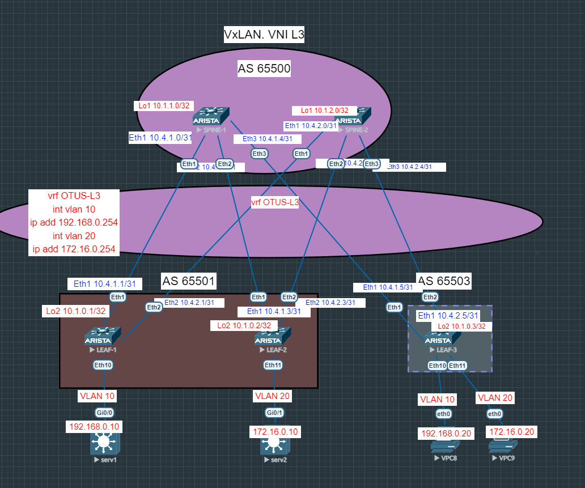

# Лабораторная работа №6
## Overlay. VxLAN. L3VNI.

### Цель:

- Настроить маршрутизацию в рамках Overlay между клиентами
- Настроите каждого клиента в своем VNI
- Настроите маршрутизацию между клиентами

## Выполнение:

### Схема сети



### Конфигурация оборудования

<details>
<summary>spine-1</summary>

- #### [SPINE-1](config/SPINE-1.conf)
```
router bgp 65500
   router-id 10.1.1.0
   timers bgp 3 9
   maximum-paths 10
   neighbor 10.1.0.1 remote-as 65501
   neighbor 10.1.0.1 next-hop-unchanged
   neighbor 10.1.0.1 update-source Loopback1
   neighbor 10.1.0.1 ebgp-multihop 3
   neighbor 10.1.0.1 send-community extended
   neighbor 10.1.0.2 remote-as 65502
   neighbor 10.1.0.2 next-hop-unchanged
   neighbor 10.1.0.2 update-source Loopback1
   neighbor 10.1.0.2 ebgp-multihop 3
   neighbor 10.1.0.2 send-community extended
   neighbor 10.1.0.3 remote-as 65503
   neighbor 10.1.0.3 next-hop-unchanged
   neighbor 10.1.0.3 update-source Loopback1
   neighbor 10.1.0.3 ebgp-multihop 3
   neighbor 10.1.0.3 send-community extended
   neighbor 10.4.1.1 remote-as 65501
   neighbor 10.4.1.1 rib-in pre-policy retain all
   neighbor 10.4.1.1 send-community
   neighbor 10.4.1.1 maximum-routes 1000
   neighbor 10.4.1.3 remote-as 65502
   neighbor 10.4.1.3 rib-in pre-policy retain all
   neighbor 10.4.1.3 send-community
   neighbor 10.4.1.3 maximum-routes 1000
   neighbor 10.4.1.5 remote-as 65503
   neighbor 10.4.1.5 rib-in pre-policy retain all
   neighbor 10.4.1.5 send-community
   neighbor 10.4.1.5 maximum-routes 1000
   redistribute connected
   !
   address-family evpn
      neighbor 10.1.0.1 activate
      neighbor 10.1.0.2 activate
      neighbor 10.1.0.3 activate
   !
   address-family ipv4
      neighbor 10.4.1.1 activate
      neighbor 10.4.1.3 activate
      neighbor 10.4.1.5 activate
!
end
```
</details>

<details>
<summary>spine-2</summary>

- #### [SPINE-2](config/SPINE-2.conf)
```
router bgp 65500
   router-id 10.1.2.0
   timers bgp 3 9
   maximum-paths 10
   neighbor 10.1.0.1 remote-as 65501
   neighbor 10.1.0.1 next-hop-unchanged
   neighbor 10.1.0.1 update-source Loopback1
   neighbor 10.1.0.1 ebgp-multihop 3
   neighbor 10.1.0.1 send-community extended
   neighbor 10.1.0.2 remote-as 65502
   neighbor 10.1.0.2 next-hop-unchanged
   neighbor 10.1.0.2 update-source Loopback1
   neighbor 10.1.0.2 ebgp-multihop 3
   neighbor 10.1.0.2 send-community extended
   neighbor 10.1.0.3 remote-as 65503
   neighbor 10.1.0.3 next-hop-unchanged
   neighbor 10.1.0.3 update-source Loopback1
   neighbor 10.1.0.3 ebgp-multihop 3
   neighbor 10.1.0.3 send-community extended
   neighbor 10.4.2.1 remote-as 65501
   neighbor 10.4.2.1 rib-in pre-policy retain all
   neighbor 10.4.2.1 send-community
   neighbor 10.4.2.1 maximum-routes 1000
   neighbor 10.4.2.3 remote-as 65502
   neighbor 10.4.2.3 rib-in pre-policy retain all
   neighbor 10.4.2.3 send-community
   neighbor 10.4.2.3 maximum-routes 1000
   neighbor 10.4.2.5 remote-as 65503
   neighbor 10.4.2.5 rib-in pre-policy retain all
   neighbor 10.4.2.5 send-community
   neighbor 10.4.2.5 maximum-routes 1000
   redistribute connected
   !
   address-family evpn
      neighbor 10.1.0.1 activate
      neighbor 10.1.0.2 activate
      neighbor 10.1.0.3 activate
   !
   address-family ipv4
      neighbor 10.4.2.1 activate
      neighbor 10.4.2.3 activate
      neighbor 10.4.2.5 activate
!
end
```
</details>

<details>
<summary>leaf-1</summary>

- #### [LEAF-1](config/LEAF-1.conf)
```
vlan 10,20
!
vrf instance OTUS-L3
!
interface Ethernet1
   description SPINE-1
   no switchport
   ip address 10.4.1.3/31
   bfd interval 100 min-rx 100 multiplier 3
!
interface Ethernet2
   description SPINE-2
   no switchport
   ip address 10.4.2.3/31
   bfd interval 100 min-rx 100 multiplier 3
!
interface Loopback2
   ip address 10.1.0.1/32
!
interface Loopback100
   description NVE Loopback
   ip address 10.100.0.1/32
!
interface Vlan10
   vrf OTUS-L3
   ip address virtual 192.168.0.254/24
!
interface Vlan20
   vrf OTUS-L3
   ip address virtual 172.16.0.254/24
!
interface Vxlan1
   vxlan source-interface Loopback100
   vxlan udp-port 4789
   vxlan vlan 10 vni 10010
   vxlan vlan 20 vni 10020
   vxlan vrf OTUS-L3 vni 444
   vxlan learn-restrict any
!
ip virtual-router mac-address 00:00:00:00:00:01
!
ip routing
ip routing vrf OTUS-L3
!
router bgp 65501
   router-id 10.1.0.1
   timers bgp 3 9
   maximum-paths 3 ecmp 3
   neighbor 10.1.1.0 remote-as 65500
   neighbor 10.1.1.0 update-source Loopback2
   neighbor 10.1.1.0 ebgp-multihop 3
   neighbor 10.1.1.0 send-community extended
   neighbor 10.1.2.0 remote-as 65500
   neighbor 10.1.2.0 update-source Loopback2
   neighbor 10.1.2.0 ebgp-multihop 3
   neighbor 10.1.2.0 send-community extended
   neighbor 10.4.1.0 remote-as 65500
   neighbor 10.4.1.0 allowas-in 1
   neighbor 10.4.1.0 rib-in pre-policy retain all
   neighbor 10.4.1.0 send-community extended
   neighbor 10.4.1.0 maximum-routes 1000
   neighbor 10.4.2.0 remote-as 65500
   neighbor 10.4.2.0 allowas-in 1
   neighbor 10.4.2.0 rib-in pre-policy retain all
   neighbor 10.4.2.0 send-community extended
   neighbor 10.4.2.0 maximum-routes 1000
   redistribute connected
   !
   vlan 10
      rd 65501:10010
      route-target both 10:10010
      redistribute learned
   !
   vlan 20
      rd 65501:10020
      route-target both 20:10020
      redistribute learned
   !
   address-family evpn
      neighbor 10.1.1.0 activate
      neighbor 10.1.2.0 activate
   !
   address-family ipv4
      neighbor 10.4.1.0 activate
      neighbor 10.4.2.0 activate
   !
   vrf OTUS-L3
      rd 65501:444
      route-target import evpn 444:444
      route-target export evpn 444:444
!
end
```
</details>

<details>
<summary>leaf-2</summary>

- #### [LEAF-2](config/LEAF-2.conf)
```
vlan 10,20
!
vrf instance OTUS-L3
!
interface Ethernet11
   description to-client-2
   switchport access vlan 20
!
interface Loopback2
   ip address 10.1.0.2/32
!
interface Loopback100
   description NVE Loopback
   ip address 10.100.0.2/32
!
interface Vlan10
   vrf OTUS-L3
   ip address virtual 192.168.0.254/24
!
interface Vlan20
   vrf OTUS-L3
   ip address virtual 172.16.0.254/24
!
interface Vxlan1
   vxlan source-interface Loopback100
   vxlan udp-port 4789
   vxlan vlan 10 vni 10010
   vxlan vlan 20 vni 10020
   vxlan vrf OTUS-L3 vni 444
   vxlan learn-restrict any
!
ip virtual-router mac-address 00:00:00:00:00:02
!
ip routing
ip routing vrf OTUS-L3
!
router bgp 65502
   router-id 10.1.0.2
   timers bgp 3 9
   maximum-paths 3 ecmp 3
   neighbor 10.1.1.0 remote-as 65500
   neighbor 10.1.1.0 update-source Loopback2
   neighbor 10.1.1.0 ebgp-multihop 3
   neighbor 10.1.1.0 send-community extended
   neighbor 10.1.2.0 remote-as 65500
   neighbor 10.1.2.0 update-source Loopback2
   neighbor 10.1.2.0 ebgp-multihop 3
   neighbor 10.1.2.0 send-community extended
   neighbor 10.4.1.2 remote-as 65500
   neighbor 10.4.1.2 allowas-in 1
   neighbor 10.4.1.2 rib-in pre-policy retain all
   neighbor 10.4.1.2 send-community extended
   neighbor 10.4.1.2 maximum-routes 1000
   neighbor 10.4.2.2 remote-as 65500
   neighbor 10.4.2.2 allowas-in 1
   neighbor 10.4.2.2 rib-in pre-policy retain all
   neighbor 10.4.2.2 send-community extended
   neighbor 10.4.2.2 maximum-routes 1000
   redistribute connected
   !
   vlan 10
      rd 65502:10010
      route-target both 10:10010
      redistribute learned
   !
   vlan 20
      rd 65502:10020
      route-target both 20:10020
      redistribute learned
   !
   address-family evpn
      neighbor 10.1.1.0 activate
      neighbor 10.1.2.0 activate
   !
   address-family ipv4
      neighbor 10.4.1.2 activate
      neighbor 10.4.2.2 activate
   !
   vrf OTUS-L3
      rd 65502:444
      route-target import evpn 444:444
      route-target export evpn 444:444
!
end
```
</details>

<details>
<summary>leaf-3</summary>

- #### [LEAF-3](config/LEAF-3.conf)
```
vlan 10,20
!
vrf instance OTUS-L3
!
interface Ethernet10
   description to-client-1
   switchport access vlan 10
!
interface Ethernet11
   description to-client-2
   switchport access vlan 20
!
interface Loopback2
   ip address 10.1.0.3/32
!
interface Loopback100
   description NVE Loopback
   ip address 10.100.0.3/32
!
interface Vlan10
   vrf OTUS-L3
   ip address virtual 192.168.0.254/24
!
interface Vlan20
   vrf OTUS-L3
   ip address virtual 172.16.0.254/24
!
interface Vxlan1
   vxlan source-interface Loopback100
   vxlan udp-port 4789
   vxlan vlan 10 vni 10010
   vxlan vlan 20 vni 10020
   vxlan vrf OTUS-L3 vni 444
   vxlan learn-restrict any
!
ip virtual-router mac-address 00:00:00:00:00:03
!
ip routing
ip routing vrf OTUS-L3
!
router bgp 65503
   router-id 10.1.0.3
   timers bgp 3 9
   maximum-paths 3 ecmp 3
   neighbor 10.1.1.0 remote-as 65500
   neighbor 10.1.1.0 update-source Loopback2
   neighbor 10.1.1.0 ebgp-multihop 3
   neighbor 10.1.1.0 send-community extended
   neighbor 10.1.2.0 remote-as 65500
   neighbor 10.1.2.0 update-source Loopback2
   neighbor 10.1.2.0 ebgp-multihop 3
   neighbor 10.1.2.0 send-community extended
   neighbor 10.4.1.4 remote-as 65500
   neighbor 10.4.1.4 allowas-in 1
   neighbor 10.4.1.4 rib-in pre-policy retain all
   neighbor 10.4.1.4 send-community extended
   neighbor 10.4.1.4 maximum-routes 1000
   neighbor 10.4.2.4 remote-as 65500
   neighbor 10.4.2.4 allowas-in 1
   neighbor 10.4.2.4 rib-in pre-policy retain all
   neighbor 10.4.2.4 send-community extended
   neighbor 10.4.2.4 maximum-routes 1000
   redistribute connected
   !
   vlan 10
      rd 65503:10010
      route-target both 10:10010
      redistribute learned
   !
   vlan 20
      rd 65503:10020
      route-target both 20:10020
      redistribute learned
   !
   address-family evpn
      neighbor 10.1.1.0 activate
      neighbor 10.1.2.0 activate
   !
   address-family ipv4
      neighbor 10.4.1.4 activate
      neighbor 10.4.2.4 activate
   !
   vrf OTUS-L3
      rd 65503:444
      route-target import evpn 444:444
      route-target export evpn 444:444
!
end
```
</details>

<details>
<summary>Serv-1</summary>

- #### [Serv-1](config/Serv-1.conf)
```
 ip address 192.168.0.10 255.255.255.0
 ip route 0.0.0.0 0.0.0.0 192.168.0.254
```
</details>

<details>
<summary>Serv-2</summary>

- #### [Serv-2](config/Serv-2.conf)
```
ip address 172.16.0.10 255.255.255.0
ip route 0.0.0.0 0.0.0.0 172.16.0.254
```
</details>

<details>
<summary>VPCS8</summary>

- #### [VPCS8](config/VPCS8.conf)
```
IP/MASK     : 192.168.0.20/24
GATEWAY     : 192.168.0.254
```
</details>

<details>
<summary>VPCS9</summary>

- #### [VPCS9](config/VPCS9.conf)
```
IP/MASK     : 172.16.0.20/24
GATEWAY     : 172.16.0.254
```
</details>

### Проверка связанности устройств в VxLAN EVPN для L3.

<details>
<summary>leaf-1</summary>

```
LEAF-1#sh bgp evpn route-type mac-ip
BGP routing table information for VRF default
Router identifier 10.1.0.1, local AS number 65501
Route status codes: * - valid, > - active, S - Stale, E - ECMP head, e - ECMP
                    c - Contributing to ECMP, % - Pending BGP convergence
Origin codes: i - IGP, e - EGP, ? - incomplete
AS Path Attributes: Or-ID - Originator ID, C-LST - Cluster List, LL Nexthop - Link Local Nexthop

          Network                Next Hop              Metric  LocPref Weight  Path
 * >Ec    RD: 65503:10010 mac-ip 0050.7966.6808
                                 10.100.0.3            -       100     0       65500 65503 i
 *  ec    RD: 65503:10010 mac-ip 0050.7966.6808
                                 10.100.0.3            -       100     0       65500 65503 i
 * >Ec    RD: 65503:10010 mac-ip 0050.7966.6808 192.168.0.20
                                 10.100.0.3            -       100     0       65500 65503 i
 *  ec    RD: 65503:10010 mac-ip 0050.7966.6808 192.168.0.20
                                 10.100.0.3            -       100     0       65500 65503 i
 * >Ec    RD: 65503:10020 mac-ip 0050.7966.6809
                                 10.100.0.3            -       100     0       65500 65503 i
 *  ec    RD: 65503:10020 mac-ip 0050.7966.6809
                                 10.100.0.3            -       100     0       65500 65503 i
 * >Ec    RD: 65503:10020 mac-ip 0050.7966.6809 172.16.0.20
                                 10.100.0.3            -       100     0       65500 65503 i
 *  ec    RD: 65503:10020 mac-ip 0050.7966.6809 172.16.0.20
                                 10.100.0.3            -       100     0       65500 65503 i
 * >Ec    RD: 65502:10020 mac-ip 5000.0011.0001
                                 10.100.0.2            -       100     0       65500 65502 i
 *  ec    RD: 65502:10020 mac-ip 5000.0011.0001
                                 10.100.0.2            -       100     0       65500 65502 i
 * >Ec    RD: 65502:10020 mac-ip 5000.0011.0001 172.16.0.10
                                 10.100.0.2            -       100     0       65500 65502 i
 *  ec    RD: 65502:10020 mac-ip 5000.0011.0001 172.16.0.10
                                 10.100.0.2            -       100     0       65500 65502 i
 * >      RD: 65501:10010 mac-ip aaaa.0010.0000
                                 -                     -       -       0       i
 * >      RD: 65501:10010 mac-ip aaaa.0010.0000 192.168.0.10
                                 -                     -       -       0       i

```
</details>

<details>
<summary>leaf-2</summary>

```
LEAF-2#sh bgp evpn route-type mac-ip
BGP routing table information for VRF default
Router identifier 10.1.0.2, local AS number 65502
Route status codes: * - valid, > - active, S - Stale, E - ECMP head, e - ECMP
                    c - Contributing to ECMP, % - Pending BGP convergence
Origin codes: i - IGP, e - EGP, ? - incomplete
AS Path Attributes: Or-ID - Originator ID, C-LST - Cluster List, LL Nexthop - Link Local Nexthop

          Network                Next Hop              Metric  LocPref Weight  Path
 * >Ec    RD: 65503:10010 mac-ip 0050.7966.6808
                                 10.100.0.3            -       100     0       65500 65503 i
 *  ec    RD: 65503:10010 mac-ip 0050.7966.6808
                                 10.100.0.3            -       100     0       65500 65503 i
 * >Ec    RD: 65503:10010 mac-ip 0050.7966.6808 192.168.0.20
                                 10.100.0.3            -       100     0       65500 65503 i
 *  ec    RD: 65503:10010 mac-ip 0050.7966.6808 192.168.0.20
                                 10.100.0.3            -       100     0       65500 65503 i
 * >Ec    RD: 65503:10020 mac-ip 0050.7966.6809
                                 10.100.0.3            -       100     0       65500 65503 i
 *  ec    RD: 65503:10020 mac-ip 0050.7966.6809
                                 10.100.0.3            -       100     0       65500 65503 i
 * >Ec    RD: 65503:10020 mac-ip 0050.7966.6809 172.16.0.20
                                 10.100.0.3            -       100     0       65500 65503 i
 *  ec    RD: 65503:10020 mac-ip 0050.7966.6809 172.16.0.20
                                 10.100.0.3            -       100     0       65500 65503 i
 * >      RD: 65502:10020 mac-ip 5000.0011.0001
                                 -                     -       -       0       i
 * >      RD: 65502:10020 mac-ip 5000.0011.0001 172.16.0.10
                                 -                     -       -       0       i
 * >Ec    RD: 65501:10010 mac-ip aaaa.0010.0000
                                 10.100.0.1            -       100     0       65500 65501 i
 *  ec    RD: 65501:10010 mac-ip aaaa.0010.0000
                                 10.100.0.1            -       100     0       65500 65501 i
 * >Ec    RD: 65501:10010 mac-ip aaaa.0010.0000 192.168.0.10
                                 10.100.0.1            -       100     0       65500 65501 i
 *  ec    RD: 65501:10010 mac-ip aaaa.0010.0000 192.168.0.10
                                 10.100.0.1            -       100     0       65500 65501 i
```
</details>

<details>
<summary>leaf-3</summary>

```
LEAF-3#show bgp evpn  route-type mac-ip
BGP routing table information for VRF default
Router identifier 10.1.0.3, local AS number 65503
Route status codes: * - valid, > - active, S - Stale, E - ECMP head, e - ECMP
                    c - Contributing to ECMP, % - Pending BGP convergence
Origin codes: i - IGP, e - EGP, ? - incomplete
AS Path Attributes: Or-ID - Originator ID, C-LST - Cluster List, LL Nexthop - Link Local Nexthop

          Network                Next Hop              Metric  LocPref Weight  Path
 * >      RD: 65503:10010 mac-ip 0050.7966.6808
                                 -                     -       -       0       i
 * >      RD: 65503:10010 mac-ip 0050.7966.6808 192.168.0.20
                                 -                     -       -       0       i
 * >      RD: 65503:10020 mac-ip 0050.7966.6809
                                 -                     -       -       0       i
 * >      RD: 65503:10020 mac-ip 0050.7966.6809 172.16.0.20
                                 -                     -       -       0       i
 * >Ec    RD: 65502:10020 mac-ip 5000.0011.0001
                                 10.100.0.2            -       100     0       65500 65502 i
 *  ec    RD: 65502:10020 mac-ip 5000.0011.0001
                                 10.100.0.2            -       100     0       65500 65502 i
 * >Ec    RD: 65502:10020 mac-ip 5000.0011.0001 172.16.0.10
                                 10.100.0.2            -       100     0       65500 65502 i
 *  ec    RD: 65502:10020 mac-ip 5000.0011.0001 172.16.0.10
                                 10.100.0.2            -       100     0       65500 65502 i
 * >Ec    RD: 65501:10010 mac-ip aaaa.0010.0000
                                 10.100.0.1            -       100     0       65500 65501 i
 *  ec    RD: 65501:10010 mac-ip aaaa.0010.0000
                                 10.100.0.1            -       100     0       65500 65501 i
 * >Ec    RD: 65501:10010 mac-ip aaaa.0010.0000 192.168.0.10
                                 10.100.0.1            -       100     0       65500 65501 i
 *  ec    RD: 65501:10010 mac-ip aaaa.0010.0000 192.168.0.10
                                 10.100.0.1            -       100     0       65500 65501 i

```
</details>

### Таблица маршрутизации в VRF
```
LEAF-1#sho ip route  vrf OTUS-L3
VRF: OTUS-L3
Gateway of last resort is not set

 B E      172.16.0.10/32 [200/0] via VTEP 10.100.0.2 VNI 444 router-mac 50:00:00:03:37:66 local-interface Vxlan1
 B E      172.16.0.20/32 [200/0] via VTEP 10.100.0.3 VNI 444 router-mac 50:00:00:15:f4:e8 local-interface Vxlan1
 C        172.16.0.0/24 is directly connected, Vlan20
 B E      192.168.0.20/32 [200/0] via VTEP 10.100.0.3 VNI 444 router-mac 50:00:00:15:f4:e8 local-interface Vxlan1
 C        192.168.0.0/24 is directly connected, Vlan10
```
```
LEAF-2#sho ip route  vrf OTUS-L3
VRF: OTUS-L3
Gateway of last resort is not set

 B E      172.16.0.20/32 [200/0] via VTEP 10.100.0.3 VNI 444 router-mac 50:00:00:15:f4:e8 local-interface Vxlan1
 C        172.16.0.0/24 is directly connected, Vlan20
 B E      192.168.0.10/32 [200/0] via VTEP 10.100.0.1 VNI 444 router-mac 50:00:00:d5:5d:c0 local-interface Vxlan1
 B E      192.168.0.20/32 [200/0] via VTEP 10.100.0.3 VNI 444 router-mac 50:00:00:15:f4:e8 local-interface Vxlan1
 C        192.168.0.0/24 is directly connected, Vlan10
```
```
LEAF-3#sho ip route  vrf OTUS-L3
VRF: OTUS-L3
Gateway of last resort is not set

 B E      172.16.0.10/32 [200/0] via VTEP 10.100.0.2 VNI 444 router-mac 50:00:00:03:37:66 local-interface Vxlan1
 C        172.16.0.0/24 is directly connected, Vlan20
 B E      192.168.0.10/32 [200/0] via VTEP 10.100.0.1 VNI 444 router-mac 50:00:00:d5:5d:c0 local-interface Vxlan1
 C        192.168.0.0/24 is directly connected, Vlan10
```

### Проверка связанности по ping
<details>
<summary>Serv-1</summary>

```
Serv-1#ping 192.168.0.10
Type escape sequence to abort.
Sending 5, 100-byte ICMP Echos to 192.168.0.10, timeout is 2 seconds:
!!!!!
Success rate is 100 percent (5/5), round-trip min/avg/max = 1/1/1 ms
Serv-1#ping 192.168.0.20
Type escape sequence to abort.
Sending 5, 100-byte ICMP Echos to 192.168.0.20, timeout is 2 seconds:
!!!!!
Success rate is 100 percent (5/5), round-trip min/avg/max = 18/18/21 ms
Serv-1#ping 172.16.0.10
Type escape sequence to abort.
Sending 5, 100-byte ICMP Echos to 172.16.0.10, timeout is 2 seconds:
!!!!!
Success rate is 100 percent (5/5), round-trip min/avg/max = 21/23/24 ms
Serv-1#ping 172.16.0.20
Type escape sequence to abort.
Sending 5, 100-byte ICMP Echos to 172.16.0.20, timeout is 2 seconds:
!!!!!
Success rate is 100 percent (5/5), round-trip min/avg/max = 28/29/31 ms
Serv-1#sho ip int br
Interface              IP-Address      OK? Method Status                Protocol
GigabitEthernet0/0     192.168.0.10    YES NVRAM  up                    up
```

</details>

<details>
<summary>Serv-2</summary>

```
Serv-2#ping 192.168.0.10
Type escape sequence to abort.
Sending 5, 100-byte ICMP Echos to 192.168.0.10, timeout is 2 seconds:
!!!!!
Success rate is 100 percent (5/5), round-trip min/avg/max = 20/21/23 ms
Serv-2#ping 192.168.0.20
Type escape sequence to abort.
Sending 5, 100-byte ICMP Echos to 192.168.0.20, timeout is 2 seconds:
!!!!!
Success rate is 100 percent (5/5), round-trip min/avg/max = 18/21/30 ms
Serv-2#ping 172.16.0.10
Type escape sequence to abort.
Sending 5, 100-byte ICMP Echos to 172.16.0.10, timeout is 2 seconds:
!!!!!
Success rate is 100 percent (5/5), round-trip min/avg/max = 1/1/1 ms
Serv-2#ping 172.16.0.20
Type escape sequence to abort.
Sending 5, 100-byte ICMP Echos to 172.16.0.20, timeout is 2 seconds:
!!!!!
Success rate is 100 percent (5/5), round-trip min/avg/max = 20/21/24 ms
Serv-2#sho ip int br
Interface              IP-Address      OK? Method Status                Protocol
GigabitEthernet0/0     unassigned      YES unset  administratively down down
GigabitEthernet0/1     172.16.0.10     YES manual up                    up
```
</details>
